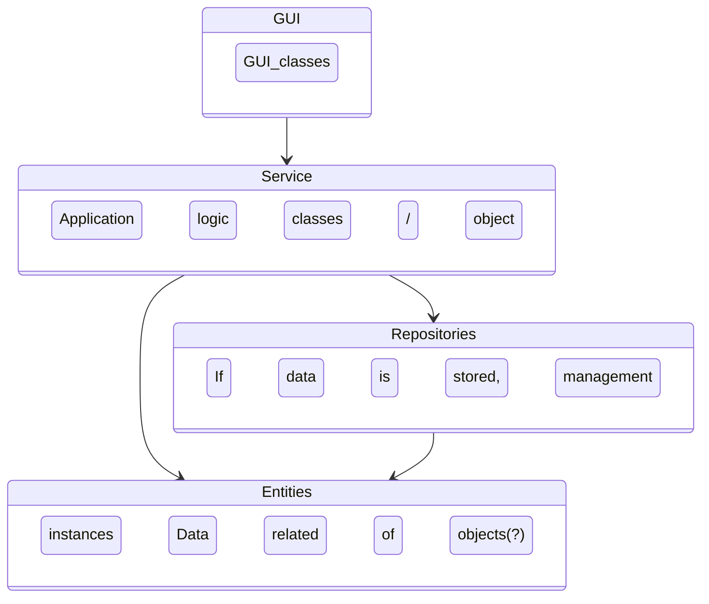

# Project architecture
This document was not required in the course tasks and it is mainly meant for personal learning and documentation.

## Package structure
The initial idea is to apply the layered architecture framework. The project will have a GUI-package for constructing and managing graphical user interfaces. Service package will handle the application logic. Entities package will handle possible entity objects (such as data to be compressed / compressed data). It is at this time unclear whether the application will have a repository. I am interested in including a database for storing compressed data.

