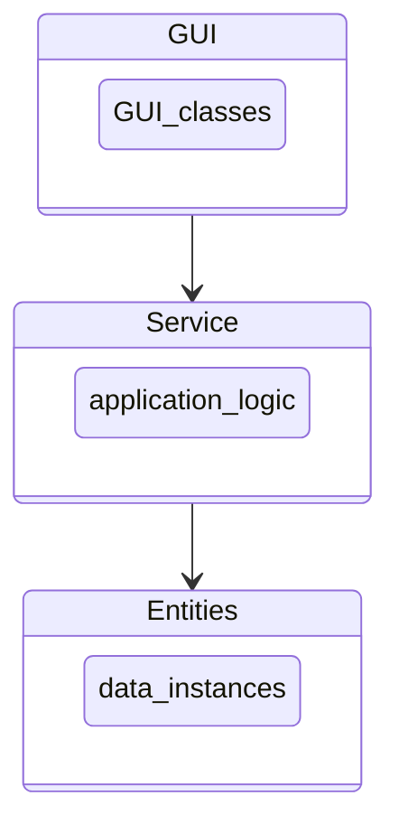
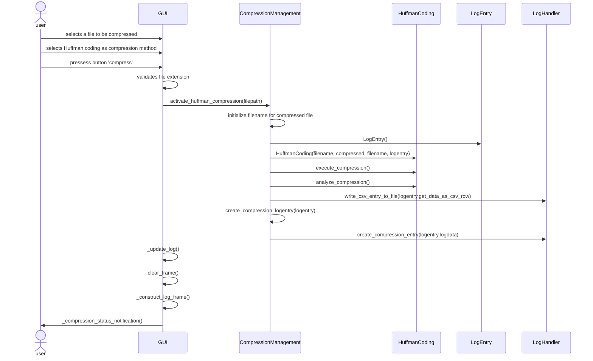
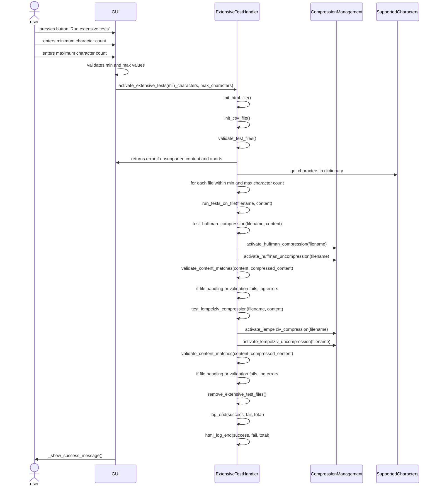

# Project architecture
This document was not required in the course tasks and it is mainly meant for personal learning and documentation. 

## Package structure
The application follows the concept of the layered architecture framework. 

* The project will have a GUI-package for constructing and managing graphical user interfaces.
  - GUI: Constructs GUI and handles the GUI-logic
  - MainView: The first view shown to user
  - CompressionView: View in which user can compress/uncompress data
  - TestingView: View from which user can operate the extensive testing
  - SetTheme: Configures visual the theme for the application
  - Menu: Constructs the menubar for the application
* Service package handles the application logic.
  - FileManagement: Handles accessing and writing content from/to files
  - CompressionManagement: Handles logic related to compression/uncompression
  - ExtensiveTestHandler: Handles user operated extensive tests
  - LogHandler: Handles logic involved in creating log-entries
  - GraphManagement: Creates graphs (this could also be an entity, but for design reasons was included here)
* Entities package contains the algorithms to be included (Huffman coding and LZ77) and log entries. 
  - HuffmanCoding: compress/uncompress data with an algorithm based on Huffman coding
  - LempelZiv77: compress/uncompress data with an algorithm based on Lempel-Ziv 77
  - LogEntry: create a new log entry
  - SupportedCharacters: creates an object instance containing the supported characters.

## Main functionalities
In this section the reader can review some core fuctionalities of the application logic as detailed sequence diagrams.

### Compressing a file with Huffman coding
The following sequence diagram details the process of compressing a file with the Huffman coding. The application logic for compression with both Huffman coding and LZ77 is similar. 

### Running extensive tests
Running extensive tests is the most complex set of operations in this given application. For easier readability most steps of the logic related to object instances from the Entities package and other instances from service package have been omitted from the sequence diagram. This process involves instances from all objects from the Entities package and multiple object instances from the service package (LogHandler, GraphManagement) that are now left out from the diagram.

