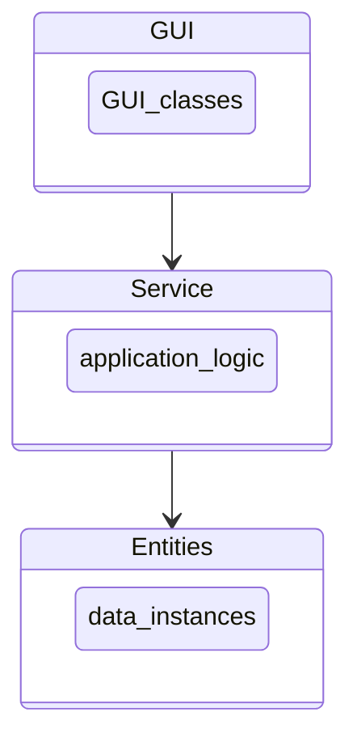

# Project architecture
This document was not required in the course tasks and it is mainly meant for personal learning and documentation. 

## Package structure
The application follows the concept of the layered architecture framework. 

* The project will have a GUI-package for constructing and managing graphical user interfaces.
  - GUI: Constructs GUI and handles the GUI-logic
  - MainView: The first view shown to user
  - CompressionView: View in which user can compress/uncompress data
  - TestingView: View from which user can operate the extensive testing
  - SetTheme: Configures visual the theme for the application
  - Menu: Constructs the menubar for the application
* Service package handles the application logic.
  - FileManagement: Handles accessing and writing content from/to files
  - CompressionManagement: Handles logic related to compression/uncompression
  - ExtensiveTestHandler: Handles user operated extensive tests
  - LogHandler: Handles logic involved in creating log-entries
  - GraphManagement: Creates graphs (this could also be an entity, but for design reasons was included here)
* Entities package contains the algorithms to be included (Huffman coding and LZ77) and log entries. 
  - HuffmanCoding: compress/uncompress data with an algorithm based on Huffman coding
  - LempelZiv77: compress/uncompress data with an algorithm based on Lempel-Ziv 77
  - LogEntry: create a new log entry

