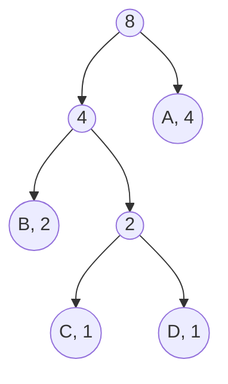

# Design documentation

## General Structure

- The general structure of the application architecture and application logic can be reviewed in the [architecture documentation](architecture.md)
- The general structure of the application GUI can be overviewed in the [how-to-guide](how-to-guide.md).

## Algorithms introduced
The purpose of this project was to study two well known algorithms designed for lossless data compression: Huffman coding and Lempel-Ziv 77. For easier testing and reviewing experience, a short introductory to these algorithms will be introduced. More detailed descriptions can be found from the sources at the end of this document. 

### Huffman coding
A main idea in the Huffman coding is that often some characters are used more frequently than others. It is then reasonable to store data in a way that the most frequent charcters take the least amount of space and the characters that are the least frequent take the most amount of space.  

To do this, we first must calculate **frequencies** for all characters. These can also be viewed as **probabilities**. This is simply done by calculating how many times each character repeats in the material.  

After this, a Huffman tree is created. Huffman tree is a binary tree build by using the minimum Heap. The idea is to construct a tree, where the longest paths are to the least frequent characters, and the shortest paths to the most frequent characters. For instance consider the string `AAAABBCD`. We can easily count that it has the following frequencies: `A = 4, B = 2, C = 1, D = 1`. The Huffman tree built from this string could roughly look similar to something like this:


As we can see, each node has a frequency and a node with children has a frequency of `frequency of left child + frequency of right child`. It is important to note as can be seen that the Huffman tree is not a balanced tree, but as the structure is built based on the frequencies, the time spending traversing the tree is balanced. 

Now we can create the Huffman codes for all characters. This is simply done by documenting, how the tree should be traversed to reach the character. We can do this by deciding that with a '0' we go left and with a '1' we go right. This way to the Huffman codes for this tree would be:

```
A = 1
B = 00
C = 010
D = 011
```

As we can see, we now have to traverse only one step to reach 'A', which we do most frequently and in rarer occations we traverse a longer path. 

To compress the data we now can store the content by simply storing the tree and the traversal paths. In this application the tree is stored in a pre-order, which crudely put means that we go left for as long as we can, then we go right until we can go left again. As we know that in Huffman tree each node has two children, this can be easily applied. Now if 0 means 'go left' and 1 means 'go right', the pre-order version of the tree would now be:

```
001011
```
And then the compressed content would be:
```
111100010011
```

When we uncompress the content, we simply re-construct the tree and then traverse it based on the compressed content. Each time we end up in a leaf, we add the character in the said leaf node and start traversing again from the root of the tree. In this example the first bit in the compressed content `111100010011` is 1, so we would traverse right. We then conclude that we are in a leaf node and can traverse no further, so we add the character "A" and start again from the root. 

### Lempel-Ziv 77
One central idea in Lempel-Ziv 77 is, that in natural language there is often repetition. Consider for instance the following naive sentence:

```
To compress and uncompress content is potentially marvelous!
```

It deliberately has some very easily detectable repetition. We can see, that for instance the string `compress` can be found twice, as can the string `tent`, which is in words 'content' and 'potentially.' Now the idea is, that if we look back on content we have already accessed, we can find the longest possible match and then instruct the algorithm to add that to the end of the string.

Consider now another crude example to demonstrate this idea:

```
AABABCABC
```

As we can now see, when we start going through the material from left to right, our first letter is A. We have not yet seen that letter as we have no previous material to look at, so we store it. We also store information on where it was found (called offset) and the length of match we found. The format is `(offset, length, next character)`. This time it was found right here, so the offset is 0 and the length of the match is one, leaving us with (0, 1, A). 

We then move on and now we have another "A". Now we have a window into which we can look at to find matches. 
```
 Window     Lookahead buffer
   A     |     ABABCABC
```

We have already seen this character so we can note that a match can be found by moving back one step. The length of the match then is one. We then get (1, 1, A). Now the window slides. 
```
 Window     Lookahead buffer
   AA    |     BABCABC
```

We move on and for the next character we get (0, 1, B) by following the previous logic as there is no match in the window. The window slides again and we find a match (2, 1, A). 
```
 Window     Lookahead buffer
   AAB    |     ABCABC
```
After this things will get more interesting as we now can find longer matches! As we look at the window, we can see that the longest match this time is 'AB'. So now we can set the offset to be 2 and length of the match to be two, and we get (2, 2, A). Now we move the window two steps, as the match was found. 
```
 Window     Lookahead buffer
   AABAB   |     CABC
```

Now again no match is found and we add (0, 1, C)
```
 Window     Lookahead buffer
   AABABC   |     ABC
```

And now as we already are familiar with the basics, we see that a match of length three can be found, and we store (3, 3, A). Now the compressed content is:

```
(0, 1, A)
(1, 1, A)
(0, 1, B)
(2, 2, A)
(0, 1, C)
(3, 3, A)
```
Now we can also see that we really don't need the next character each time, only when no match was found. We can then simplify the above to be
```
(0, 1, A)
(1, 1)
(0, 1, B)
(2, 2)
(0, 1, C)
(3, 3)
```
We can simplify the data to be stored even further by deciding that when a character is stored, the offset is always 0 and length is 1. So we don't really need this information. Now the data is: 
```
(A)
(1, 1)
(B)
(2, 2)
(C)
(3, 3)
```
Then, depending on the space requirements of the offset and length, we can decide if it is worth it to store short matches. It can take more space to store (1, 1) that it would take to store the character 'A.'  

One detail worth mentioning is that in many applications of the Lempel-Ziv 77 a **sliding window** is used. This means that the match can continue into the lookahead buffer. For instance in the following case

```
  Window    |  Lookahead buffer
    ABC          ABCABC
```
The offset would be 3 but the length could be more than that, for example 9. As we can see, we can parse the next characters from the content that we a constructing. Because this application uses Python's built-it `str.rfind` to find optimal matches, this marvelous idea was omitted from the implementation. This idea is explained in more detail for instance in [this article](https://towardsdatascience.com/how-data-compression-works-exploring-lz77-3a2c2e06c097)

### Writing compressed content to a file
Currently the data is written to file as bytes. First data is tranformed into a bytearray and then written. This is my first time working with bit transformation and the solution is most likely quite naive and perhaps inefficient. Data is now first turned into a string of 1's and 0' and then divided into bytes (8 bits). This data is then stored as bytes to a file.

**Huffman coding**  
The bits included in the file created with Huffman compression consist of:
- Length of the stored tree: 12 bits
- Number of extra bits: 4 bits
- Number of unique ASCII-characters: byte
- Tree structure in pre-order
- Characters in the original content
- Compressed content
- Extra bits (to make the content into bytes)

**Lempel-Ziv**  
The bits stored into the file include:
- Compressed data
  - When a match is found: 
    - indicator (value 1): 1 bit
    - offset: 12 bits
    - match length: 4 bits
    - total: 17 bits
  - When no match was found
    - indicator (value 0): 1 bit
    - character: 8 bits (byte)
    - total: 9 bits


## Accomplished Time and Space Complexities 

### Lempel-Ziv 77 
The Lempel Ziv compression algorithm goes through the whole content once. At each index a search is executed, where string content for the length of the window is looked through. Matches for the length between 3 to buffer size are looked for iteratively with Python's built-in `str.find()` method. The process is repeated for each index of the content n that is being compressed, so the time complexity is n * search time. 

Based on Python's documentation this method uses Boyer-Moore, Sunday and Horspool - algorithms, and has the worst case time complexity of O(n*m), average time complexity of O(n) and lower case time complexity of O(n / m), in which n equals the size of the string from where a match is looked for ([source 1](http://web.archive.org/web/20151113000216/effbot.org/zone/stringlib.htm), [source 2](https://hg.python.org/cpython/file/5444c2e22ff8/Objects/stringobject.c#l1742)). 

From this an estimate of the total time complexity can be created. A rough worst case time complexity would be O(k * m * n * n) = O(k * m * n^2), in which
- k = characters in content that is compressed
- m = characters in sliding window
- n = characters in lookahead buffer

In uncompression content is added to the end of the string iteratively. If a match exists, it is looked for in the existing string. Otherwise the next character is available in the stored data. In the worst case a match of the length of the buffer is found at every index > buffer size. In this scenario for each step a buffer lenght of sting data is copied and added to the end of the string. This takes O(n) of time, where n is the number of characters in the uncompressed content. 


### Huffman coding
[John Morris]((https://www.cs.auckland.ac.nz/software/AlgAnim/huffman.html)) from the University of Auckland presents, that the time complexity of the compression phase of Huffman coding is O(n log n).  

The huffman coding consists of different steps that have different time complexities. 
- Calculating frequencies. This is done in an iterative loop with constant time calculations, time complexity being O(n)
- Building of minimum heap. The heap operations take a time of O(log n) and as the content is gone through iteratively this requires a time complexity of O(n)

I 

- In the uncompression phase the Huffman tree is traversed. The tree is not balanced, but the path lengths are based on probabilities (frequencies) of characters. I will need to investigate the time complexity of this operation. 

## Performance and O-analysis comparison
As written above, this is still under investigation.

## Known Quality Issues and Suggestions for Improvement

### Data manipulation
Data manipulation to bit form is quite naive due to lack of experience. This affects the efficiency of the compression ratio. With more experience with bit-transformation the compression ratio could most likely be significantly improved. Also data fetch and write time could be improved

### Limited character support
Currently only printable ASCII-charcters are supported:
```
'0123456789abcdefghijklmnopqrstuvwxyzABCDEFGHIJKLMNOPQRSTUVWXYZ!"#$%&\'()*+,-./:;<=>?@[\\]^_`{|}~'
```
In addition following characters are supported:
- (32) # whitespace
- (10) # line-break
- (228) # ä
- (196) # Ä
- (197) # Å
- (229) # å
- (246) # ö
- (214) # Ö

In the future the application could be expanded to handle a wider variety of ASCII-characters. 

### Canonical Huffman tree could be introduced
While researching the subject I came across the concept of [canonical Huffman code](https://en.wikipedia.org/wiki/Canonical_Huffman_code). It could perhaps be used to improve the efficiency of the Huffman compression. Due to time constraints I did not have a chance to pursue this, but it could be a worthwile addition in the future. 

### Lempel-Ziv 77 ideal offset should be investigated
For the test material in this project the average offset length was between 1100-1300 characters. This means that in most occations the optimal match can be found within that distance. Currently the window size is 4096 and storing the offset value takes 12 bits. If the window size was 2048, it would require 11 bits and compression speed would increase. This means that for each match found we would save one bit of space. As the minimum match searched for is now three characters, this would mean that for each found match the compression ratio would be in the worst case 2/3 which is approximately 0.67. 

### Lempel-Ziv 77 character storing should be investigated
Currently all characters take one byte of space. The range of characters is however limited and perhaps less space would suffice. The number of characters is less than 128, so 7 bits could be enough for uniquelly identifying each character. This way for each character stored (= when no match is found) a byte of space would be required. This way the compression ratio would be 1.0. 

# Sources

**Huffman coding:**  
[1] Geeks for Geeks' [article](https://www.geeksforgeeks.org/huffman-coding-greedy-algo-3/) on Huffman coding  
[2] Microsoft Documentation: [2.1.4.2 Huffman Code Construction Phase](https://docs.microsoft.com/en-us/openspecs/windows_protocols/ms-xca/35a83e96-981d-48ed-a4eb-0b9cc6b51440)  
[3] Wikipedia: [Huffman coding](https://en.wikipedia.org/wiki/Huffman_coding)  
[4] John Morris: [Huffman encoding](https://www.cs.auckland.ac.nz/software/AlgAnim/huffman.html)  
[5] Stack Overflow: [Storing Huffman tree](https://stackoverflow.com/questions/759707/efficient-way-of-storing-huffman-tree)  
[6] Wikipedia: [Canonical Huffman Coding](https://en.wikipedia.org/wiki/Canonical_Huffman_code)
  
**LZ77**  
[7] Towards Data Science: [How data compression works: Exploring LZ77](https://towardsdatascience.com/how-data-compression-works-exploring-lz77-3a2c2e06c097)  
[8] Microsoft Documentation: [2.1.1.1.1 LZ77 Compression Algorithm](https://docs.microsoft.com/en-us/openspecs/windows_protocols/ms-wusp/fb98aa28-5cd7-407f-8869-a6cef1ff1ccb)  
[9] Wikipedia: [LZ77 and LZ78](https://en.wikipedia.org/wiki/LZ77_and_LZ78)  
[10] PADS: [Practical Algorithms and Data structures on Strings](https://www.cs.helsinki.fi/group/pads/)  
[11] Kempa, Dominik, and Dmitry Kosolobov. “LZ-End Parsing in Linear Time.” (2017): n. pag. Print.  
[12] Kosolobov, Dmitry. “Relations Between Greedy and Bit-Optimal LZ77 Encodings.” (2018): n. pag. Print.  
[13] Professor Blelloch, Guy. Lecture slides from course "Algorithms in the 'Real World'": https://www.cs.cmu.edu/~guyb/realworld/slidesF08/suffixcompress.pdf  
  
**General**  
[14] Cormen, Thomas H. Introduction to Algorithms. 3rd ed. Cambridge, Mass: MIT Press, 2009.  
[15] Salomon, D. (David). A Concise Introduction to Data Compression. London: Springer, 2008. Print.  
[16] Sayood, Khalid. Introduction to Data Compression. 3rd ed. Amsterdam ;: Elsevier, 2006. Print.  
[17] Salomon, Daṿid, and Giovanni Motta. Handbook of Data Compression. 5th ed. 2010. London: Springer London, 2010. Web.  

**Video-sources**  
[18] Computerphile: [Elegant compression in Text (the LZ 77 method)](https://youtu.be/goOa3DGezUA)  
[19] Google Developers: [The LZ77 Compression Family](https://youtu.be/Jqc418tQDkg)  
[20] Tom Scott: [How Computers Compress Text: Huffman coding and Huffman Trees](https://youtu.be/JsTptu56GM8)  
[21] Computerphile: [How Huffman Trees Work](https://youtu.be/umTbivyJoiI)  
[22] Google Developers: [Compressor Head - series](https://youtu.be/Eb7rzMxHyOk)

**Python-specific**  
[23] [Source code for object str](https://hg.python.org/cpython/file/5444c2e22ff8/Objects/stringobject.c#l1742)  
[24] [An archived blog post by Frederik Lundh](http://web.archive.org/web/20151113000216/effbot.org/zone/stringlib.htm)  