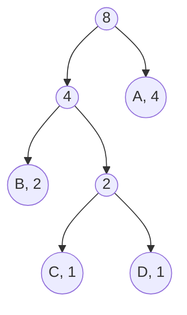
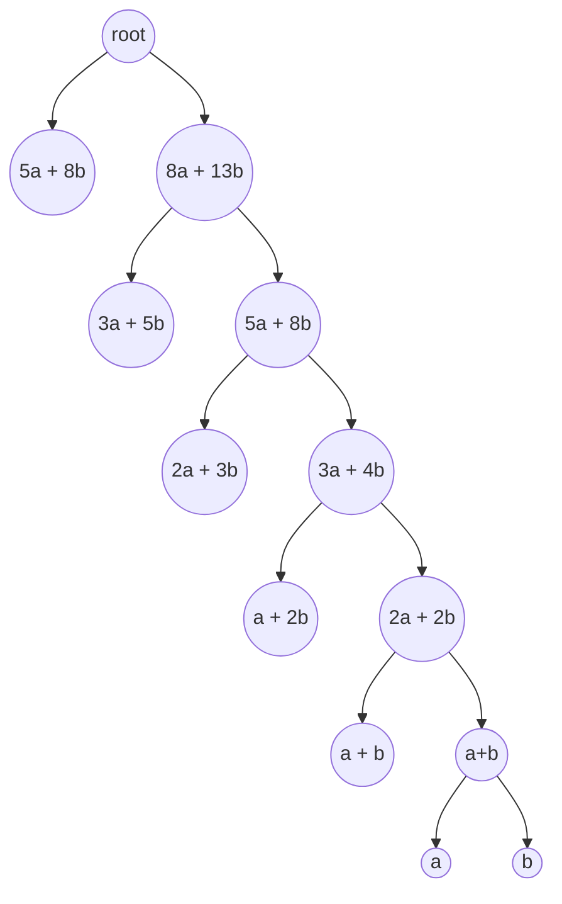

# Implementation documentation

## Application structure

- The general structure of the application architecture and application logic, including sequence diagrams, can be reviewed in the [architecture documentation](architecture.md)
- The general structure of the application GUI can be overviewed in the [how-to-guide](how-to-guide.md).

## Algorithms introduced
The purpose of this project was to study two well known algorithms and/or compression methods designed for lossless data compression: Huffman coding and Lempel-Ziv 77. For easier testing and reviewing experience, a short introductory to these algorithms will be introduced. More detailed descriptions can be found from the sources at the end of this document. 

### Huffman coding
A main idea in the Huffman coding is that often some characters are used more frequently than others. It is then reasonable to store data in a way that the most frequent charcters take the least amount of space and the characters that are the least frequent take the most amount of space.  

To do this, we first must calculate **frequencies** for all characters. These can also be viewed as **probabilities**. This is simply done by calculating how many times each character repeats in the material.  

After this, a Huffman tree is created. Huffman tree is a binary tree build by using the minimum Heap. The idea is to construct a tree, where the longest paths are to the least frequent characters, and the shortest paths to the most frequent characters. For instance consider the string `AAAABBCD`. We can easily count that it has the following frequencies: `A = 4, B = 2, C = 1, D = 1`. The Huffman tree built from this string could roughly look similar to something like this:


As we can see, each node has a frequency and a node with children has a frequency of `frequency of left child + frequency of right child`. It is important to note as can be seen that this implementation of the Huffman tree is not a balanced tree, but as the structure is built based on the frequencies, the time spending traversing the tree is balanced. This means that the shorter paths are traversed more often than the longer paths.

Now we can create the Huffman codes for all characters. This is done by documenting, how the tree should be traversed to reach each character. We can do this by deciding that with a '0' we go left and with a '1' we go right. This way the Huffman codes for this tree would be:

```
A = 1
B = 00
C = 010
D = 011
```

As we can see, we now have to traverse only one edge to reach 'A', which we do most frequently and in rarer occations we traverse a longer path. Using the Huffman coded values the compressed content would now be:
```
AAAA B B  C  D
11110000010011
```

To uncompress the stored content we need to have the tree, the characters and the Huffman coded content (traversal paths). In this application the tree is stored in a [pre-order](https://en.wikipedia.org/wiki/Tree_traversal#Pre-order,_NLR), in which we 

- visit a node
- recursively traverse left in the current node's subtree
- recursively traverse right in the current node's subtree
- when traversing ends in a leaf node, store the character in that leaf node

Now if 0 means 'go left' and 1 means 'go right', the pre-order version of the tree would now be:

```
001011
```
And the order in which the characters were stored would be
```
BCDA
```

When we uncompress the content, we first re-construct the tree from the stored preorder structure. While constructing the tree we add the stored characters to leaf nodes in order. After the tree is constructed we then traverse it based on the compressed content. Each time we end up in a leaf, we add the character in the said leaf node and start traversing again from the root of the tree. In this example the first bit in the compressed content `11110000010011` is 1, so we would traverse right. We then conclude that we are in a leaf node and can traverse no further, so we add the character "A" and start again from the root. 

### Lempel-Ziv 77
One central idea in Lempel-Ziv 77 is, that in natural language there is often repetition. Consider for instance the following naive sentence:

```
To compress and uncompress content is potentially marvelous!
```

It deliberately has some very easily detectable repetition. We can see, that for instance the string `compress` can be found twice, as can the string `tent`, which is in words 'content' and 'potentially.' Now the idea is, that if we look back on content we have already accessed, we can find the longest possible match and then instruct the algorithm to add that to the end of the string.

Consider now another crude example to demonstrate this idea:

```
AABABCABC
```

As we can now see, when we start going through the material from left to right, our first letter is A. We have not yet seen that letter as we have no previous material to look at, so we store it. We also store information on where it was found (called offset) and the length of match we found. The format is `(offset, length, next character)`. This time it was found right here, so the offset is 0 and the length of the match is one, leaving us with (0, 1, A). 

We then move on and now we have another "A". Now we have a window into which we can look at to find matches. 
```
 Window     Lookahead buffer
   A     |     ABABCABC
```

We have already seen this character so we can note that a match can be found by moving back one step. The length of the match then is one. We then get (1, 1, A). Now the window slides. 
```
 Window     Lookahead buffer
   AA    |     BABCABC
```

We move on and for the next character we get (0, 1, B) by following the previous logic as there is no match in the window.  
```
 Window     Lookahead buffer
   AAB    |     ABCABC
```
After this things will get more interesting as we now can find longer matches! As we look at the window, we can see that the longest match this time is 'AB'. So now we can set the offset to be 2 and length of the match to be 2, and we get (2, 2, A). Now we move the window two steps, as a match was found. 
```
 Window     Lookahead buffer
   AABAB   |     CABC
```

Now again no match is found and we add (0, 1, C)
```
 Window     Lookahead buffer
   AABABC   |     ABC
```

And now as we already are familiar with the basics, we see that a match of length three can be found, and we store (3, 3, A). Now the compressed content is:

```
(0, 1, A)
(1, 1, A)
(0, 1, B)
(2, 2, A)
(0, 1, C)
(3, 3, A)
```
Now we can also see that we really don't need the next character each time, only when no match was found. We can then simplify the above to be
```
(0, 1, A)
(1, 1)
(0, 1, B)
(2, 2)
(0, 1, C)
(3, 3)
```
We can simplify the data to be stored even further by deciding that when a character is stored, the offset is always 0 and length is 1. So we don't really need this information. Now the data is: 
```
(A)
(1, 1)
(B)
(2, 2)
(C)
(3, 3)
```
Then, depending on the space requirements of the offset and length, we can decide if it is worth it to store short matches. It can take more space to store (1, 1) that it would take to store the character 'A.' In this application the minimum length for a match must be 3 characters. 

One detail worth mentioning is that in many applications of the Lempel-Ziv 77 a **sliding window** is used. This means that the match can continue into the lookahead buffer. For instance in the following case

```
  Window    |  Lookahead buffer
    ABC          ABCABC
```
The offset would be 3 but the length could be more than that, for example 9. As we can see, we can parse the next characters from the content that we a constructing. Because this application uses Python's built-it `str.rfind` to find optimal matches, this marvelous idea was omitted from the implementation. This idea is explained in more detail for instance in [this article](https://towardsdatascience.com/how-data-compression-works-exploring-lz77-3a2c2e06c097)

### Writing compressed content to a file
Currently the data is written to file as bytes. First data is tranformed into a bytearray and then written. This is my first time working with bit transformation and the solution is most likely quite naive and perhaps inefficient. Data is now first turned into a string of 1's and 0' and then divided into bytes (8 bits). This data is then stored as bytes to a file.

**Huffman coding**  
The bits included in the file created with Huffman compression consist of:
- Length of the stored tree: 12 bits
- Number of extra bits: 4 bits
- Number of unique ASCII-characters: byte
- Tree structure in pre-order
- Characters in the original content
- Compressed content
- Extra bits (to make the content into bytes)

**Lempel-Ziv**  
The bits stored into the file include:
- Compressed data
  - When a match is found: 
    - indicator (value 1): 1 bit
    - offset: 12 bits
    - match length: 4 bits
    - total: 17 bits
  - When no match was found
    - indicator (value 0): 1 bit
    - character: 7 bits (byte)
    - total: 8 bits

It is worth noting that on Lempel-Ziv 77 the list of supported characters is not the standard 7-bit ASCII-characters. Because of this the application has a class in Entities -package to manage transformation of the characters into 7-bit numeric presentations. Due to this each character for which no match was found take up a byte of space (the same amount as before compression) instead of nine bits (a byte for character and 1 bit indicator). This is beneficial in the edge case scenarios in which no compression happens. Without this optimation the compressed size could exceed the original size with Lempel-Ziv 77 implementation.


## Accomplished Time Complexities and Space Requirements

### Lempel-Ziv 77 
In the compression phase the Lempel Ziv 77 algorithm iterates through the whole content once. At each iterative step a search is executed and an optimal match is search for from the lookahead buffer and the window. Matches are searched for with Python's built-in `str.find()` method. The process is repeated at each iterative step of the content `k` that is being compressed. In the worst case scenario no matches are found and the process needs to be repeated at each index, so the time complexity is `k * search time`. 

Based on Python's documentation `str.find()` uses Boyer-Moore, Sunday and Horspool - algorithms, and has the worst case time complexity of `O(n*m)`, average time complexity of `O(n)` and lower case time complexity of `O(n / m)`, in which `n` equals the size of the string from where a match is looked for and `m` equals the string that for which matches are looked for ([source 1](http://web.archive.org/web/20151113000216/effbot.org/zone/stringlib.htm), [source 2](https://hg.python.org/cpython/file/5444c2e22ff8/Objects/stringobject.c#l1742)).  

It is important to note that if a match of x characters is found **and** x < lookahead buffer size, the algorithm then looks for a match for 'x + 1' characters. As the minimum length for match is 3 characters, each match still reduce the time complexity from the worst case scenario in which no matches are found at any index, since matches reduce the indexes in which the search has to be performed.

From this an estimate of the total worst case time complexity can be created. A rough worst case time complexity would be `O(k * m * n)`, in which
- k = characters in content that is compressed
- m = characters in sliding window
- n = characters in lookahead buffer

In the uncompression-phase the compressed content is gone through iteratively once, making the time complexity `O(k)`, in which `k` is the length of the uncompressed content.

The space complexity is more related to a particular implementation. In this project the space requirements are as follows
- Compression phase
  - A string of uncompressed content (k characters)
  - List of tuples (offset, length, ord(character)) (max. k tuples)
  - List of bit tranformations in string form, then joined into one string
  - Bytearray formed from the string in previous step
- Uncompression phase
  - Bytes read from file transformed into a string
  - List of tuples formed from the string
  - list of characters of uncompressed content, then joined to a string


### Huffman coding
Let `k` be the length of the content to be compressed and `n` be the number of unique characters in the material. The Huffman compression begins with iterating through the content `k` once to calculate the frequencies, taking a linear time of `O(k)`.  

After the frequencies are calculated, the Huffman tree is created. [John Morris](https://www.cs.auckland.ac.nz/software/AlgAnim/huffman.html) from the University of Auckland presents, that the time complexity of the encoding phase of Huffman coding is `O(n log n)`, in which n is the numbers of characters in the constructed tree. A similar time complexity is presented in Cormen et. al. book 'Introduction to Algorithms.' In some sources (i.e. [[1]](https://www.cs.umd.edu/class/fall2017/cmsc451-0101/Lects/lect06-greedy-huffman.pdf) [[2]](https://www.codesdope.com/course/algorithms-huffman-codes/)) the implementation used in this project is called a **greedy algorithm** as the algorithm always chooses the best available option when combining frequencies.

After this phase the Huffman coded values are calculated by traversing the tree `n` times, taking the time complexity of `O(n log n)`. Finally the compressed content is created by iteratively going through the content `k` to create a Huffman coded version of the content. This is done in the linear time of `O(k)`.  

To sum up, the Huffman coding consists of different steps that have different time complexities. 
- Calculating frequencies. This is done in an iterative loop with constant time calculations, time complexity being `O(k)`
- Building of minimum heap. The heap operations take a time of `O(log n)` and both creating and traversing the tree contain `n` steps making the required time `O(n log n)`
- Creating the Huffman coded content, which takes the linear time of `O(k)`
- Put together the time complexity is `O(k + n log n)`

As the maximum character count is `102` for this project, it quickly follows as file sizes grow that the time complexity in compression phase is close to the linear time of `O(k),`  

In the uncompression phase the Huffman tree is first reconstructed taking linear time equal to the number of nodes. After this the uncompressed content is recreated by traversing the tree `k` times.

As in this implementation the structure of the tree depends on the frequencies of the compressed content, the structure can vary. Emeritus Professor Salomon and Dr. Motta (source 17 at the end of the document) present that in the worst case the longest path in a similarily as in this project construted tree can be of length `n-1` by giving the following example (in which xa + yb are the frequencies of each node):


In all the included sources there was no definitive time complexity given for the decompression process using this approach to constructing the Huffman tree. It is my reasoning that as the tree structure is based on the frequencies of the characters, in an edge case as detailed above, the variance in frequencies has to be higher, meaning that in decompression phase the most common characters are found from the shortest paths.  

The frequencies of the leaf nodes (characters) in the binary tree above are `5a +8b, 3a + 5b, 2a + 3b, a + 2b, a + b, a, b`. If the tree was balanced, the height of the tree would be 3 as there are seven leaf nodes.  

As we can see, the leaf node `a` has the smallest frequency, meaning that `a < b` and thus we can present that `13a, 8a, 5a, 3a, 2a, a, a < 5a +8b, 3a + 5b, 2a + 3b, a + 2b, a + b, a, b`, meaning that 

- for each time we traverse to `a`, we traverse atleast 13 times to the most common frequency `5a + 8b`
- 21 times for each `a` to the two most common frequencies (`5a + 8b` and `3a + 5b`)

Which are both under the complexity of `O(log n)`. We exceed the time complexity in only the four rarest cases. By calculating the total frequencies we now get from left to right:

```
5a + 8b = 13/33
3a + 5b = 8/33
5a = 5/33
3a = 3/33
2a = 2/33
a = 1/33
a = 1/33

Making the average traversal steps taken 

1 x 13/33 + 2 x 8/33 + 3x 5/33 + 4 x 3/33 + 5 x 2/33 + 5 x 1/33 + 5 x 1/33 = 2.3

Which is under the balanced tree height of 3.
```

As we can see in this edge case the traversal times are balanced out, making the time complexity be in this edge case in the range of `O(k log n)`. One edge case does not offer definitive proof and there is some amount of uncertainty left on this time complexity.  

It is my current understanding that the time complexity of the decompression phase falls under `O(k log n)`, because the frequencies balance the steps taken while traversing the tree. The online tutorial-site [CodeScope](https://www.codesdope.com/course/algorithms-huffman-codes/) suggests similar time complexity for decoding, but the article has no author, so it is hard to estimate it's credibility. 

To sum it up, the uncompression phase of Huffman coding has the following steps:

- reconstructing the Huffman tree in linear time `O(m)` in which `m` equals the number of nodes
- traversing the Huffman tree `k` times to decode the content, which to my best understanding takes the time of `O(k log n)`

The space complexity is more related to a particular implementation. In this implementation the space requirements are as follows:
- Compression-phase:
  - string of uncompressed content
  - Dictionary of Huffman frequencies (max. 102 key-value pairs)
  - Creation of Huffman tree (node-objects, max of c*n nodes in which c is a constant and n is the number of unique characters)
  - Creating a dictionary of Huffman coded values (max. 102 key-value pairs)
  - Creating a huffman coded list from content
  - joining tree, Huffman codes for characters and Huffman coded content as a string
  - creating a list of bytes from content and then joining a string object of byte content
- Uncompression-phase
  - creating a string of byte content, transforming it to a list of bytes
  - creating a list of string content from the bytes, joining it to strings (tree, characters, coded content)
  - creating the Huffman tree
  - creating a list of uncompressed content, joining a string-object from the list.

### Summary
The time complexities of Lempel-Ziv 77 and Huffman coding in a table

| Algorithm | Compression | Uncompression | Explanation
| ---- | ---- | ---- | ---- |
| Lempel-Ziv 77 | O(k * m * n) | O(k) | k = length of content, m = window size, n = buffer size |
| Huffman coding | O(k + n log n) | O(k log n)* | k = length of content, n = number of unique characters |

_*) Please note the uncertainty regarding this time complexity discussed in section [Accomplished time complexities and space requirements](https://github.com/heidi-holappa/tira-labra-2022/blob/master/documentation/execution-documentation.md#accomplished-time-complexities-and-space-requirements)_

## Performance and O-analysis comparison
A detailed look at the performance is included in the [testing documentation's](https://github.com/heidi-holappa/tira-labra-2022/blob/master/documentation/testing-documentation.md#performance-comparison) section 'Performance comparison.'
As written above, this is still under investigation.

## Known Quality Issues and Suggestions for Improvement

### Data manipulation
Data manipulation to bit form is quite naive due to lack of experience. This affects the efficiency of the compression ratio. With more experience with bit-transformation the compression ratio could most likely be significantly improved. Also data fetch and write time could be improved

### Limited character support
Currently only printable ASCII-charcters are supported:
```
'0123456789abcdefghijklmnopqrstuvwxyzABCDEFGHIJKLMNOPQRSTUVWXYZ!"#$%&\'()*+,-./:;<=>?@[\\]^_`{|}~'
```
In addition following characters are supported:
- (32) # whitespace
- (10) # line-break
- (228) # ä
- (196) # Ä
- (197) # Å
- (229) # å
- (246) # ö
- (214) # Ö

In the future the application could be expanded to handle a wider variety of ASCII-characters. 

### Other restrictions for content
For this project a txt file must have the minimum of 10 characters and 2 unique characters for the file to be compressed. The requirement for 2 unique characters is related to the way the Huffman tree is built in this project to avoid handling an edge case for tree creation (tree only has one leaf). It is worth noting that the compression ratio for a file that only has one unique file would be quite good for both Huffman coding and Lempel-Ziv 77, if the file was of a good size. On Huffman coding on a large file that compressed size would approach 1/8 and on Lempel-Ziv the size would approach 1/15 of the original size (as in most indexes a match of length 15 would be found).  

### Canonical Huffman tree could be introduced
While researching the subject I came across the concept of [canonical Huffman code](https://en.wikipedia.org/wiki/Canonical_Huffman_code). It could perhaps be used to improve the efficiency of the Huffman compression. Due to time constraints I did not have a chance to pursue this, but it could be a worthwile addition in the future.  

One additional benefit to implementing the Canonical Huffman tree would be that for it more definite time complexities are available. 

### Lempel-Ziv 77 ideal offset should be investigated
For the test material in this project the average offset length was between 1100-1300 characters. This means that in most occations the optimal match can be found within that distance. Currently the window size is 4096 and storing the offset value takes 12 bits. If the window size was 2048, it would require 11 bits and compression speed would increase. This means that for each match found we would save one bit of space. As the minimum match searched for is now three characters, this would mean that for each found match the compression ratio would be in the worst case 2/3 which is approximately 0.67. 

### Application logic  
The application logic would benefit from following updates:
- Improving error handling in compression / uncompression
- Improving error handling on extensive tests
- Refactoring of application logic
  - Log content creation could be more well structured
  - Some overlaps in methods in service classes Compression Management and ExtensiveTestHandler

## Pylint / Pytest  
The final Pylint score is 10.00/10.00. The following Pylint -notifications were disabled in agreement with the course assistant, as style issues are not at the focus on this course (bullet points include classes in which these issues were ignored):
- too-many-instance-attributes
  - HuffmanCoding
  - LempelZiv
- duplicate-code
  - HuffmanCoding (creating analysis data)
  - LempelZiv (creating analysis data)

The final coverage brach percentage is 99 percent. For a detailed description on the tests, please see [testing documentation](testing-documentation.md)

## Work hours for the course  
Below is a summary of the work hours put into this course. Week 7 contains the hours for final phase before the deadline.

| Week # | hours |
| ---- | ---- |
| 1 | 14 |
| 2 | 16,5 |
| 3 | 18,25 |
| 4 | 17 |
| 5 | 15,5 |
| 6 | 19 |
| 7 | 39 |
| **Total** | **139.25** |

# Sources

**Huffman coding:**  
[1] Geeks for Geeks' [article](https://www.geeksforgeeks.org/huffman-coding-greedy-algo-3/) on Huffman coding  
[2] Microsoft Documentation: [2.1.4.2 Huffman Code Construction Phase](https://docs.microsoft.com/en-us/openspecs/windows_protocols/ms-xca/35a83e96-981d-48ed-a4eb-0b9cc6b51440)  
[3] Wikipedia: [Huffman coding](https://en.wikipedia.org/wiki/Huffman_coding)  
[4] John Morris: [Huffman encoding](https://www.cs.auckland.ac.nz/software/AlgAnim/huffman.html)  
[5] Stack Overflow: [Storing Huffman tree](https://stackoverflow.com/questions/759707/efficient-way-of-storing-huffman-tree)  
[6] Wikipedia: [Canonical Huffman Coding](https://en.wikipedia.org/wiki/Canonical_Huffman_code)
  
**LZ77**  
[7] Towards Data Science: [How data compression works: Exploring LZ77](https://towardsdatascience.com/how-data-compression-works-exploring-lz77-3a2c2e06c097)  
[8] Microsoft Documentation: [2.1.1.1.1 LZ77 Compression Algorithm](https://docs.microsoft.com/en-us/openspecs/windows_protocols/ms-wusp/fb98aa28-5cd7-407f-8869-a6cef1ff1ccb)  
[9] Wikipedia: [LZ77 and LZ78](https://en.wikipedia.org/wiki/LZ77_and_LZ78)  
[10] PADS: [Practical Algorithms and Data structures on Strings](https://www.cs.helsinki.fi/group/pads/)  
[11] Kempa, Dominik, and Dmitry Kosolobov. “LZ-End Parsing in Linear Time.” (2017): n. pag. Print.  
[12] Kosolobov, Dmitry. “Relations Between Greedy and Bit-Optimal LZ77 Encodings.” (2018): n. pag. Print.  
[13] Professor Blelloch, Guy. Lecture slides from course "Algorithms in the 'Real World'": https://www.cs.cmu.edu/~guyb/realworld/slidesF08/suffixcompress.pdf  
  
**General**  
[14] Cormen, Thomas H. Introduction to Algorithms. 3rd ed. Cambridge, Mass: MIT Press, 2009.  
[15] Salomon, D. (David). A Concise Introduction to Data Compression. London: Springer, 2008. Print.  
[16] Sayood, Khalid. Introduction to Data Compression. 3rd ed. Amsterdam ;: Elsevier, 2006. Print.  
[17] Salomon, Daṿid, and Giovanni Motta. Handbook of Data Compression. 5th ed. 2010. London: Springer London, 2010. Web.  

**Video-sources**  
[18] Computerphile: [Elegant compression in Text (the LZ 77 method)](https://youtu.be/goOa3DGezUA)  
[19] Google Developers: [The LZ77 Compression Family](https://youtu.be/Jqc418tQDkg)  
[20] Tom Scott: [How Computers Compress Text: Huffman coding and Huffman Trees](https://youtu.be/JsTptu56GM8)  
[21] Computerphile: [How Huffman Trees Work](https://youtu.be/umTbivyJoiI)  
[22] Google Developers: [Compressor Head - series](https://youtu.be/Eb7rzMxHyOk)

**Python-specific**  
[23] [Source code for object str](https://hg.python.org/cpython/file/5444c2e22ff8/Objects/stringobject.c#l1742)  
[24] [An archived blog post by Frederik Lundh](http://web.archive.org/web/20151113000216/effbot.org/zone/stringlib.htm)  
