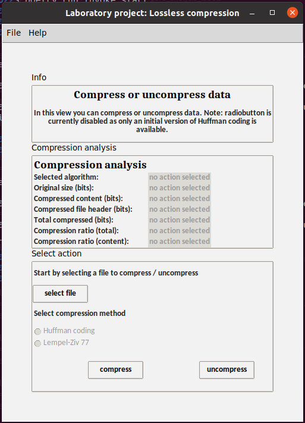
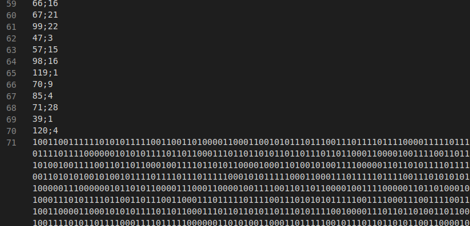
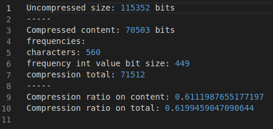

# Installation

Begin by downloading the project from GitHub. During the project stable releases will be published. Before the first release the project can be cloned. 

Install dependencies with the following command:
```
poetry install
```

Run the application with the following command:
```
poetry run invoke start
```

# How to Use the Application

Run the application with the command `poetry run invoke start`. The application start with a main screen

## Main view


From the menu a user can 
* exit the application
* access help - documentation
* view app infomartion

From the button `compress / uncompress data` user can access compression view. 

## Data compression view
At the moment data can be compressed and uncompressed with an initial Huffman coding algorithm. 



Start by selecting either an uncompressed txt-file or compressed huf-file. Two example txt-files are included for more convenient testing experience.  


One compression / uncompression done an initial crude analysis of result will be showcased. 


A compressed file is created into the same directory. At the moment the Huffman tree is unefficiently stored as integer-values (and a character separator ';'). This will change as the project progresses. 



Additionally a log-file containing initial analysis on the compression is created. The information is a bit more detailed than what is shown on the GUI view. Currently differences are minute however. In future there might be a general log-file that stores analysis data on all compressions done. 



## Configuration
The application uses dotenv for configuration. User can change the default folder used in File Explorer. 


## How To Run Tests
To run the tests use the command `poetry run invoke test` in the root folder of the project. To generate a coverage report use the command `poetry run invoke coverage-report`.


## For creator 
Below are the course guidelines on what how-to-guide should include. These are here for easier access. Will be deleted once the project is finished:

* Miten ohjelma suoritetaan, miten eri toiminnallisuuksia käytetään
* Minkä muotoisia syötteitä ohjelma hyväksyy
* Missä hakemistossa on jar ja ajamiseen tarvittavat testitiedostot.