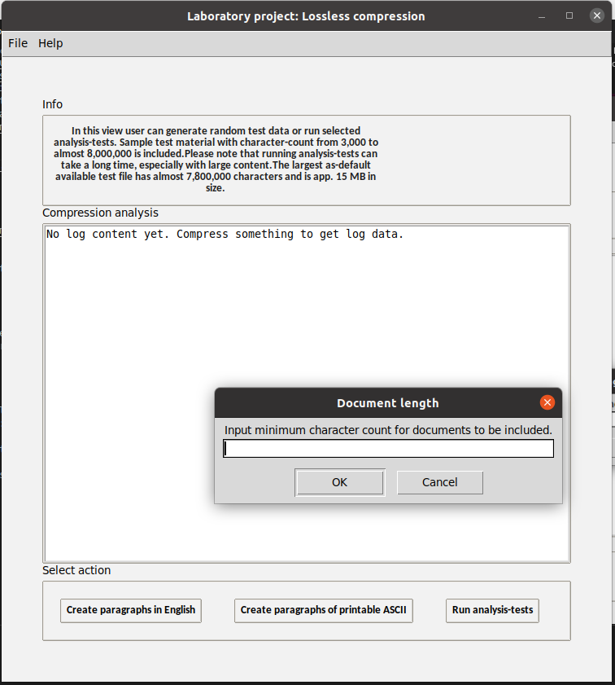

# Installation

Begin by downloading the project from GitHub either by cloning the project or by downloading the [final release](https://github.com/heidi-holappa/tira-labra-2022/releases/tag/final-release).  

Install dependencies with the following command:
```
poetry install
```

Run the application with the following command:
```
poetry run invoke start
```

# How to Use the Application

Run the application with the command `poetry run invoke start`. The application starts with a main view.

## Main view


From the menu user can 
* File-menu
  * Choose one of the available views
  * exit the application
* Help-menu
  * access help -documentation
  * access documentation on analysis-tests
  * view app information

From the button `compress / uncompress data` user can access compression view. 

From the button `Run extensive tests` user can access manually operated tests. 

## Data compression view
Data can be compressed / uncompressed with Huffman coding algorithm and Lempel-Ziv 77 algorithm. 


Start by selecting either an uncompressed txt-file or compressed huf- or lz-file. Four example txt-files are included in the default data folder for more convenient testing experience. When compressing data be sure to also choose the compression method you wish to use. 


Once compression / uncompression is done, short analysis of results will be showcased. 


A compressed/uncompressed file is created into the same directory where the accessed file is located. In compressed files data is stored as bytes.  

## Analysis-tests view
In the GUI's 'analysis-tests' view user can create new randomly created test material or run analysis-tests on the files located in the configured test-folder.  

When the analysis-tests are run, all files in the configured directory (default: test-data) that match the minimum and maximum size defined by user are included. Included files are then compressed and uncompressed. All content is validated before compression and after uncompression original and uncompressed content of each file is verified to match. Analysis data is gathered from different steps of the process.

Before running the tests user is asked to specify minimum and maximum character count for files to be included. If user for instance sets the values to `50000` and `2500000` files with a character count from 50,000 to 2,500,000 will be included in the tests. 

User can view the results of the extensive tests in the desktop application, or from a generated HTML-file. The HTML-file includes two tables and five graphs to make reviewing the test analysis easier and more enjoyable.  

A sample of an HTML-log generated with the mentioned character limits (min: 50,000; max: 2,500,000) can be reviewed [here](https://htmlpreview.github.io/?https://github.com/heidi-holappa/tira-labra-2022/blob/master/test-data/compression-log.html). Please note that the htmlpreview web-application does not load images with relative paths. To view the HTML-report with images, download a copy of this project and view the content locally on your preferred browser, or review the images in the [Github -folder](https://github.com/heidi-holappa/tira-labra-2022/tree/master/test-data/images).



## Configuration
The application uses dotenv for configuration. User can reconfigure: 
- certain paths (default compression/uncompression path, analysis-test -path)
- filenames of different log-related files
- filenames of the visualizations created for the HTML-log.


# How To Run Tests
To run the limited but quicker test-set use the command `poetry run invoke test` in the root folder of the project. This lighter test set is run every time the application launches. To run all available tests use the command `poetry run invoke extended-test`.  

To generate a coverage report use the command `poetry run invoke coverage-report`.

Please see [testing documentation](testing-documentation.md) for more information on tests.

# Supported characters
The application supports compressing txt-files with content consisting of the following characters: 

```
'0123456789abcdefghijklmnopqrstuvwxyzABCDEFGHIJKLMNOPQRSTUVWXYZ!"#$%&\'()*+,-./:;<=>?@[\\]^_`{|}~'
```
In addition following characters are supported:
- (32) # whitespace
- (10) # line-break
- (228) # ä
- (196) # Ä
- (197) # Å
- (229) # å
- (246) # ö
- (214) # Ö

Content is validated and if accessed txt-file contains unsupported characters, user is notified and compression is aborted. 

