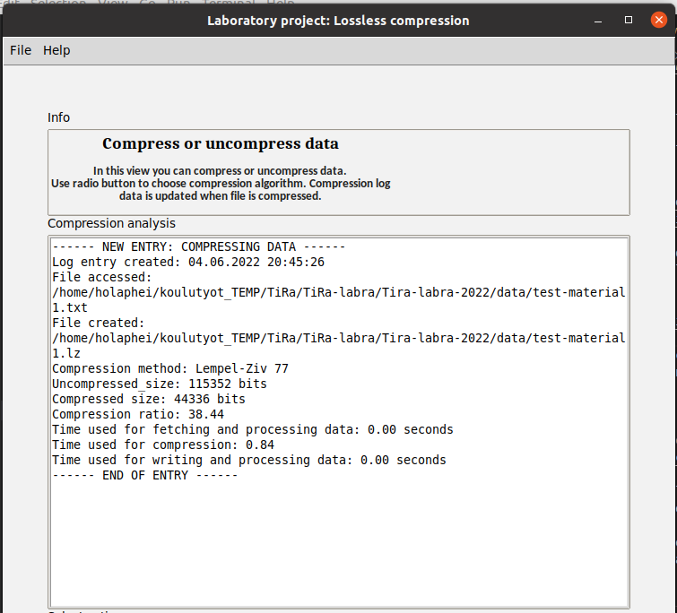

# Installation

Begin by downloading the project from GitHub. During the project stable releases will be published. Before the first release the project can be cloned. 

Install dependencies with the following command:
```
poetry install
```

Run the application with the following command:
```
poetry run invoke start
```

# How to Use the Application

Run the application with the command `poetry run invoke start`. The application starts with a main view.

## Main view


From the menu a user can 
* File-menu
  * exit the application
* Help-menu
  * access help -documentation
  * view app information

From the button `compress / uncompress data` user can access compression view. 

From the button `Run extensive tests` user can access manually operated tests. 

## Data compression view
Data can be compressed / uncompressed with Huffman coding algorithm and Lempel-Ziv 77 algorithm. 


Start by selecting either an uncompressed txt-file or compressed huf- or lz-file. Four example txt-files are included in the default data folder for more convenient testing experience.  


Once compression / uncompression is done, analysis of results will be showcased. 



A compressed file is created into the same directory. Data is stored as bytes.  

A log-file containing the showcased analysis on the compression is created. The most recent log-entry is by default in the file compression.log. The older entries are in file compression_archive.log.  


## Extensive testing view
An initial version of manually operatable tests are available. Currently user can create random data either in natural English lanaguage or as random printable ASCII-characters. User can then run extensive tests that go through all the files in the default test directory defined in the .env file. When launching the tests user is asked to define what is the maximum character length for the files to be included in testing. For instance, if user inputs 50000 (fifty thousand), files with 50,000 or less characters will be included in the tests.  


Analysis data shows a summary of the test results. It also sums the number of successful and failed tests.  


## Configuration
The application uses dotenv for configuration. User can change the default folder used in File Explorer. 


# How To Run Tests
To run the tests use the command `poetry run invoke test` in the root folder of the project. To generate a coverage report use the command `poetry run invoke coverage-report`.


# For creator 
Below are the course guidelines on what how-to-guide should include. These are here for easier access. Will be deleted once the project is finished:

* Miten ohjelma suoritetaan, miten eri toiminnallisuuksia käytetään
* Minkä muotoisia syötteitä ohjelma hyväksyy
* Missä hakemistossa on jar ja ajamiseen tarvittavat testitiedostot.