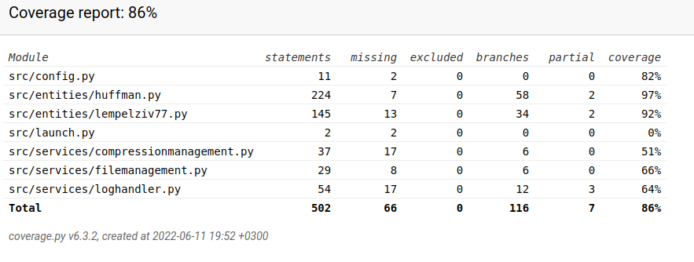
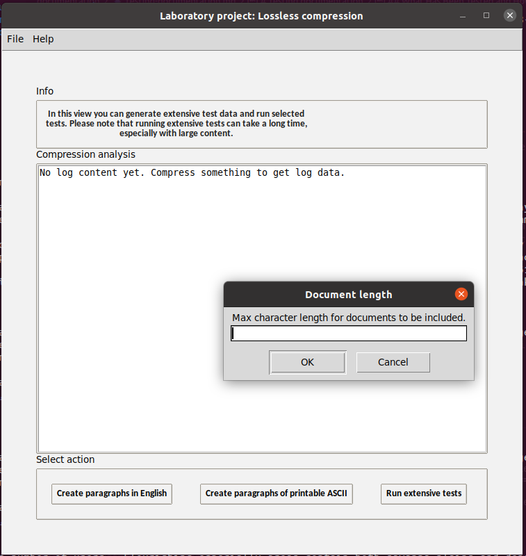

# Testing documentation
The application has automated unittests and a functionalities that allow user to create test material and run an extended test-set on selected materials. 

## Automated tests
The automated tests are also divided into two categories. Lighter tests are ran every time the application is launched. User can additionally manually launch more extensive tests from the terminal. The more extensive automated tests include testing algorithms on larger files and can take multiple minutes to run through. 

To run lighter test-set in the terminal, use the command
```
poetry run invoke test
```

To run the tests created for larger files use the command
```
poetry run invoke extended-test
```

## Extensive tests view in GUI
In the extensive tests -view user can create new test material or run tests on files of selected size. When the tests are run, all files in the configured directory (default = test-data) that match the size user defined are included and tested. The directory can be configured in the .env -file. User can also add data to the folder for testing purposes. 

## Tests to be added (to-do-list):
* Expand tests on service classes
* Research if there are ways to test space efficiency
* Consider testing service package FileManagement

## Coverage Report for Unittests
The coverage report can be run by typing the command `poetry run invoke coverage-report` in the terminal. Currently the branch coverage is 86 percent. Especially the service package classes need more extensive tests at this point.  




## What Has Been Tested and How?
At the moment automated tests are used to test most of the functionalities in entities packages. New classes in service packages still need tests to be written. Tests also include integrated testing in which instances of objects from both service and entities packages are tested simultaneously. 

The tests for algorithm classes (in package Entities) include:
- tests for byte tranformation
- tests that original and uncompressed files have matching content with files with diverse content
- For Huffman coding tests also verify that Huffman tree is correctly constructed.

User can now also manually operate extensive tests. Currently user can create random data either in natural English lanaguage or as random printable ASCII-characters. User can then run extensive tests that go through all the files in the default test directory defined in the .env file. When launching the tests user is asked to define what is the maximum character length for the files to be included in testing. For instance, if user inputs 50000 (fifty thousand), files with 50,000 or less characters will be included in the tests. 




## Input Used for Testing
At the moment tests use both predefined inputs and randomized input. Based on research it seems that tests with randomized input are not recommended. In the future focus will shift more to predefined inputs so that failed tests can be more easily replicated. 


## Redoing Tests
A user can run the automated tests by typing `poetry run invoke test` in the terminal. To create a coverage report user can use the command `poetry run invoke coverage-report`

## Visual Presentation of Test Results
See coverage report above at the beginning of the file. 


