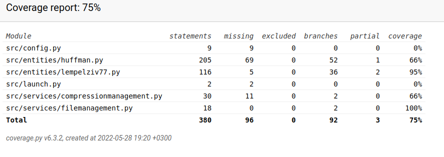

# Testing documentation

## Tests to be added (to-do-list):
* Reactivate Huffman coding tests once issues with decompression are repaired.
* Test that LZ77 produces correct result with the sliding window search. 
* Add time efficiency tests
* Research if there are ways to test space efficiency
* Consider testing service package FileManagement

## Coverage Report for Unittests
The coverage report can be run by typing the command `poetry run invoke coverage-report` in the terminal. Currently the branch coverage is 75 percent. Due to an open issue some of the tests for Huffman coding are deactivated, which influences the coverage. 

## What Has Been Tested and How?
At the moment automated tests are used to test some of the functionalities in service and entities packages. Tests also include integrated testing in which instances of objects from both service and entities packages are tested simultaneously. 

For the time being some of the tests have been deactivated as there are open issues with the Huffman coding decompression algorithm. The algorithm was re-built in week three and it still needs work. 

## Input Used for Testing
Tests use both predefined inputes and randomized input. Based on research it seems that tests with randomized input are not recommended. This is something I would like to talk about it a guidance session in the near future.  

## Redoing Tests
A user can run the automated tests by typing `poetry run invoke test` in the terminal. To create a coverage report user can use the command `poetry run invoke coverage-report`

## Visual Presentation of Test Results
See coverage report above at the beginning of the file. 

