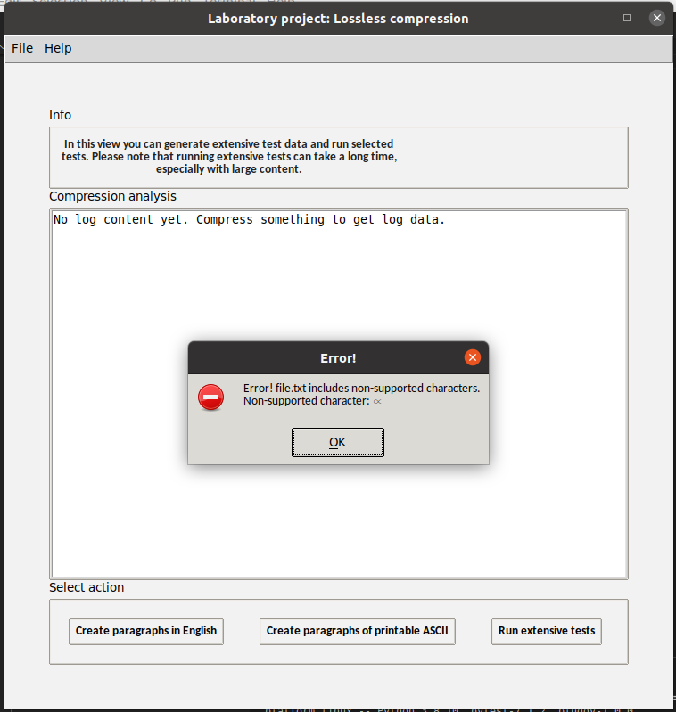

# Testing documentation
The application has automated unittests and a functionalities that allow user to create test and analysis material and run an extended test/analysis-set on selected materials. 

## Automated tests
The automated tests are divided into two categories. Lighter tests are run every time the application is launched. These tests ensure that the basic functionalities of the application run correctly. If any of the tests fail, the application won't start. These tests include (but are not limited to):

| Package | Class | Test | Notes |
| -------- | -------- | -------- | -------- |
| Services | FileManagement | File creation works | |
| Services | FileManagement | Only valid files are compressed / uncompressed | |
| Services | FileManagement | If no log file is found a default message is returned. | |
| Services | CompressionManagement | Test file extension validation works | |
| Services | ExtensiveTestHandler | All supported characters are included | |
| Services | ExtensiveTestHandler | Randomly created content only includes supported charcters | |
| Services | ExtensiveTestHandler | Content validation works as intended | Multiple tests |
| Services | ExtensiveTestHandler | HTML-report and graphs are created | |
| Services | ExtensiveTestHandler | Test that compression/uncompressoin of larger, 1-15 MB (sic), files succeeds  | Part of extended tests |
| Entities | HuffmanCoding | frequencies are calculated correctly | |
| Entities | HuffmanCoding | Huffman tree is built correctly | |
| Entities | HuffmanCoding | uncompressed file content matches the original file content with different types of content. ||
| Entities | HuffmanCoding | Huffman tree is correctly re-created in uncompression-phase ||
| Entities | HuffmanCoding | Huffman tree is correctly re-created in uncompression-phase | Multiple different tests |
| Entities | HuffmanNode | node comparison works. | class HuffmanNode is in the file huffman.py |
| Entities | Lempel-Ziv 77 | Uncompressed content matches original content | |
| Entities | Lempel-Ziv 77 | Various content-types are compressed and uncompressed correctly | |
| Entities | Lempel-Ziv 77 | Offsets, lengths and characters are correctly formed for pre-determined test content  | |

 User can additionally manually launch more extensive tests from the terminal. The more extensive automated tests include testing algorithms on larger files and can take multiple minutes to run through. 

### Running automated tests in terminal

A lighter test-set is run every time the application start. To run this lighter test-set in the terminal without starting the application, use the command
```
poetry run invoke test
```

User can also activate a test set containing more extensive tests. Please note, that running these tests can take some time. With the University provided Fuxi-laptop the tests take approximately 90 seconds. 

```
poetry run invoke extended-test
```

## Analysis-tests view
In the GUI's analysis-tests view user can create new randomly created test material or run analysis-tests on the files located in the configured test-folder that are of selected size.  

When the analysis-tests are run, all files in the configured directory (default: test-data) that match the size user defined are included. Included files are compressed and uncompressed. All content is validated before compression and after uncompression original and uncompressed content of each file is verified to match. 

User can also add data to the folder for testing purposes. The data is validated before analysis-tests begin to ensure that only supported characters are used in uploaded test-files. If there are un-supported characters in a test-file, user is shown the following notification and test-run is terminated:



Before running the tests user is asked to specify minimum and maximum character count for files to be included. If user for instance sets the values to `100000` and `2500000` files with a character count from 100,000 to 2,500,000 will be included in the tests. 

User can view the test result of the extensive tests in the desktop application, or from a generated HTML-file. The HTML-file includes two tables and five graphs to make reviewing the test analysis easier and more enjoyable.  

A sample of an HTML-log generated with the mentioned character limits (min: 100,000; max: 2,500,000) can be reviewed [here](https://htmlpreview.github.io/?https://github.com/heidi-holappa/tira-labra-2022/blob/master/test-data/compression-log.html). Please note that the htmlpreview web-application does not load images with relative paths. To view the HTML-report with images, download a copy of this project and view the content locally on your preferred browser, or review the images in the [Github -folder](https://github.com/heidi-holappa/tira-labra-2022/tree/master/test-data/images).

### Input Used for Testing
The testing material for user operated extensive analysis-tests includes:
- Files with semirandomly generated ASCII -content ([example](../test-data/random-printable-ascii-100-paragraphs.txt)). (7,000 to 70,000 characters)
- Files with semirandomly generated natural language content ([example](../test-data/natural-language-document-100-paragraphs.txt)). (3,000 to 53,000 characters)
- Public Domain content from Project Gutenberg:
  - [The Standard Operaglass, by Charles Annesley](../test-data/gutenberg-project-standar-operaglass.txt) (809,246 characters)
  - [The value of Zeta(3) to 1,000,000](../test-data/gutenberg-project-the-value-of-zeta-3.txt) (1,007,060 characters)
  - [Miscellaneous Mathematical Constants, by Various](../test-data/gutenberg-project-misc-math-constants.txt) (480,294 characters)
  - [The Martian Shore, by Charles L. Fontenay](../test-data/gutenberg-project-martian-shore.txt) (51,543 characters)
  - [Argonaut stories, by Jerome Hart](../test-data/gutenberg-project-argonaut-stories.txt) (283,094 characters)
  - [The wonder woman, by Mae Van Norman](../test-data/gutenberg-project-the-wonder-woman.txt) (254,827 characters)
  - [Top 10 books from Project Gutenberg in one file](../test-data/gutenberg-top-10.txt) (7,650,153 characters)
- Finnish classic [Seitsemän Veljestä](../test-data/seitseman-veljesta.txt) (624,402 characters)
- [First 100,000 decimals of pi](../test-data/first-100000-decimals-of-pi.txt) (100,003 characters)

For the automated tests mostly predefined inputs are used, but few tests use randomly created material. 


## Coverage Report for Unittests
The coverage report can be run by typing the command `poetry run invoke coverage-report` in the terminal. The branch coverage of the final release is 99 percent.


The following directories and files have been omitted from the branch coverage report:
- GUI -package
- test -package
- launch.py

## Configuration
The ideal goal in this project was to avoid hard-coding paths and filenames into the code. The application uses dotenv to provide configurability. User has the opportunity to re-configure: 
- certain paths (default compression/uncompression path, analysis-test -path)
- filenames of different log-related files
- filenames of the visualizations created for the HTML-log.