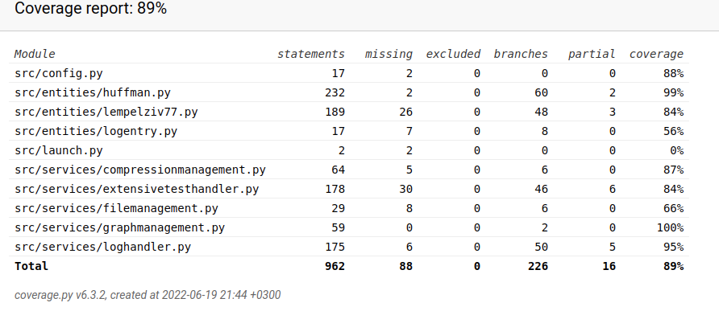

# Testing documentation
The application has automated unittests and a functionalities that allow user to create test material and run an extended test-set on selected materials. 

## Automated tests
The automated tests are also divided into two categories. Lighter tests are ran every time the application is launched. These test that the basic functionalities of the application run correctly. If any of the tests fail, the application won't start. These tests include:

| Package | Class | Test | Notes |
| -------- | -------- | -------- | -------- |
| Services | FileManagement | File creation works | |
| Services | FileManagement | Only valid files are compressed / uncompressed | |
| Services | ExtensiveTestHandler | All supported characters are included | |
| Services | ExtensiveTestHandler | Randomly created content only includes supported charcters | |
| Services | ExtensiveTestHandler | Content validation works as intended | |
| Entities | HuffmanCoding | frequencies are calculated correctly | |
| Entities | HuffmanCoding | Huffman tree is built correctly | |
| Entities | HuffmanCoding | uncompressed file content matches the original file content with different types of content. ||
| Entities | HuffmanCoding | Huffman tree is correctly re-created in uncompression-phase ||
| Entities | HuffmanCoding | Huffman tree is correctly re-created in uncompression-phase | Multiple different tests |
| Entities | HuffmanNode | node comparison works. | class HuffmanNode is in the file huffman.py |
| Entities | Lempel-Ziv 77 | Uncompressed content matches original content | |
| Entities | Lempel-Ziv 77 | Various content-types are compressed and uncompressed correctly | |

 User can additionally manually launch more extensive tests from the terminal. The more extensive automated tests include testing algorithms on larger files and can take multiple minutes to run through. Tests include validation and user is notified if validations fail. Currently validation includes:

 - Test files have content
 - Original and uncompressed contents match

## Running tests in terminal

To run lighter test-set in the terminal, use the command
```
poetry run invoke test
```

To run the tests created for larger files use the command
```
poetry run invoke extended-test
```

## Extensive tests view in GUI
In the extensive tests -view user can create new test material or run tests on files of selected size. When the tests are run, all files in the configured directory (default = test-data) that match the size user defined are included and tested. The directory can be configured in the .env -file. User can also add data to the folder for testing purposes.  

Before running the tests user is asked to specify minimum and maximum character count for files to be included. If user for instance sets the values to `100000` and `2500000` files with a character count from 100,000 to 2,500,000 will be included in the tests.  

User can view the test result of the extensive tests in the desktop application, or from a generated HTML-file. The HTML-file includes two tables and four graphs to make reviewing the test analysis easier and more enjoyable. 

## Coverage Report for Unittests
The coverage report can be run by typing the command `poetry run invoke coverage-report` in the terminal. Currently the branch coverage is 89 percent. Especially the service package classes need more extensive tests at this point.  



## Input Used for Testing
At the moment the testing material for user operated extensive tests includes:
- Files with Python-random ASCII - content. 
- Files with randomly generated natural language content. 
- Public Domain content from Project Gutenberg and the Finnish classic 'Seitsemän Veljestä'
- First 100,000 decimals of pi

For the automated tests at the moment both predefined inputs and randomized input are used. Based on research it seems that tests with randomized input are not recommended. In the future focus will shift more to predefined inputs so that failed tests can be more easily replicated. 


## Redoing Tests
A user can run the automated tests by typing `poetry run invoke test` in the terminal. To create a coverage report user can use the command `poetry run invoke coverage-report`

## Visual Presentation of coverage branch test Results
See coverage report above. 


## Tests to be added (to-do-list):
* Expand tests on service classes
* Research if there are ways to test space efficiency
* Consider testing service packages FileManagement, LogManagement, GraphManagement
* Lempel-Ziv 77 has a lighter selection of tests than Huffman Coding. Is this alright as is? 
