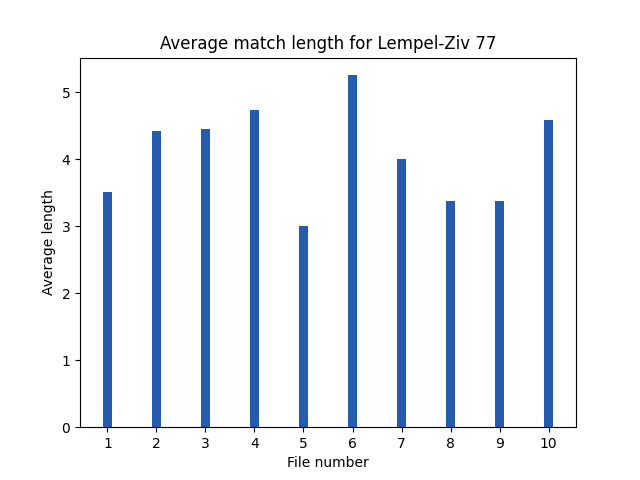

# Testing documentation
The application has automated unittests and functionalities for user to create test and analysis material and run an extended analysis-set on selected materials. Sample material is provided.

## Automated tests
The automated tests are divided into two categories. Lighter tests are run every time the application is launched. These tests ensure that the basic functionalities of the application run correctly. If any of the tests fail, the application won't start. These tests include (but are not limited to):

| Package | Class | Test | Notes |
| -------- | -------- | -------- | -------- |
| Services | FileManagement | File creation works | |
| Services | FileManagement | Only valid files are compressed / uncompressed | |
| Services | FileManagement | If no log file is found a default message is returned. | |
| Services | CompressionManagement | Test file extension validation works | |
| Services | ExtensiveTestHandler | All supported characters are included | |
| Services | ExtensiveTestHandler | Randomly created content only includes supported characters | |
| Services | ExtensiveTestHandler | Content validation works as intended | Multiple tests |
| Services | ExtensiveTestHandler | HTML-report and graphs are created | Part of extended tests |
| Services | ExtensiveTestHandler | Test that compression/uncompression of larger, 1-15 MB (sic), files succeeds  | Part of extended tests |
| Entities | HuffmanCoding | frequencies are calculated correctly | |
| Entities | HuffmanCoding | Huffman tree is built correctly | |
| Entities | HuffmanCoding | uncompressed content matches the original file content with different types of content. ||
| Entities | HuffmanCoding | Huffman tree is correctly re-created in uncompression-phase ||
| Entities | HuffmanCoding | Huffman tree is correctly re-created in uncompression-phase | Multiple different tests |
| Entities | HuffmanNode | node comparison works. | class HuffmanNode is in the file huffman.py |
| Entities | Lempel-Ziv 77 | Uncompressed content matches original content | |
| Entities | Lempel-Ziv 77 | Various content-types are compressed and uncompressed correctly | |
| Entities | Lempel-Ziv 77 | Offsets, lengths and characters are correctly formed for pre-determined test content  | |

### Running automated tests in terminal

A lighter test-set is run every time the application start. To run this lighter test-set in the terminal without starting the application, use the command
```
poetry run invoke test
```

User can also activate a test set containing more extensive tests. Please note, that running these tests can take some time. With the University provided Fuxi-laptop the tests take approximately 90 seconds. 

```
poetry run invoke extended-test
```

## Analysis-tests view
In the GUI's 'analysis-tests' view user can create new randomly created test material or run analysis-tests on the files located in the configured test-folder.  

When the analysis-tests are run, all files in the configured directory (default: test-data) that match the minimum and maximum size defined by user are included. Included files are then compressed and uncompressed. All content is validated before compression and after uncompression original and uncompressed content of each file is verified to match. Analysis data is gathered from different steps of the process.

Before running the tests user is asked to specify minimum and maximum character count for files to be included. If user for instance sets the values to `50000` and `2500000` files with a character count from 50,000 to 2,500,000 will be included in the tests. 

User can view the results of the extensive tests in the desktop application, or from a generated HTML-file. The HTML-file includes two tables and five graphs to make reviewing the test analysis easier and more enjoyable.  

A sample of an HTML-log generated with the mentioned character limits (min: 50,000; max: 2,500,000) can be reviewed [here](https://htmlpreview.github.io/?https://github.com/heidi-holappa/tira-labra-2022/blob/master/test-data/compression-log.html). Please note that the htmlpreview web-application does not load images with relative paths. To view the HTML-report with images, download a copy of this project and view the content locally on your preferred browser, or review the images in the [Github -folder](https://github.com/heidi-holappa/tira-labra-2022/tree/master/test-data/images).

### Input Used for Analysis-tests
The sample material for user operated extensive analysis-tests includes:
- Files with semirandomly generated ASCII -content ([example](../test-data/random-printable-ascii-100-paragraphs.txt)). (7,000 to 70,000 characters)
- Files with semirandomly generated natural language content ([example](../test-data/natural-language-document-100-paragraphs.txt)). (3,000 to 53,000 characters)
- Public Domain content from Project Gutenberg:
  - [The Standard Operaglass, by Charles Annesley](../test-data/gutenberg-project-standar-operaglass.txt) (809,246 characters)
  - [The value of Zeta(3) to 1,000,000](../test-data/gutenberg-project-the-value-of-zeta-3.txt) (1,007,060 characters)
  - [Miscellaneous Mathematical Constants, by Various](../test-data/gutenberg-project-misc-math-constants.txt) (480,294 characters)
  - [The Martian Shore, by Charles L. Fontenay](../test-data/gutenberg-project-martian-shore.txt) (51,543 characters)
  - [Argonaut stories, by Jerome Hart](../test-data/gutenberg-project-argonaut-stories.txt) (283,094 characters)
  - [The wonder woman, by Mae Van Norman](../test-data/gutenberg-project-the-wonder-woman.txt) (254,827 characters)
  - [Top 10 books from Project Gutenberg in one file](../test-data/gutenberg-top-10.txt) (7,650,153 characters)
- Finnish classic [Seitsemän Veljestä](../test-data/seitseman-veljesta.txt) (624,402 characters)
- [First 100,000 decimals of pi](../test-data/first-100000-decimals-of-pi.txt) (100,003 characters)

### Adding new data for analysis-tests
User can also add data to the folder for testing purposes. The data is validated before analysis-tests begin to ensure that only supported characters are used in uploaded test-files. If there are un-supported characters in a test-file, user is shown the following notification and test-run is terminated:


The following simple code can be used to create stripped a copy of a file with un-supported characters for testing purposes:

```python
import string

class RemoveUnsupportedCharacters:

    def __init__(self, filename):
        self.filename = filename

    def create_supported_copy(self):
        with open(self.filename, "r", encoding="utf-8") as file:
            content = file.read()
        document_content = ""
        characters = string.printable.split()[0]
        ascii_order_set = set()
        for char in characters:
            ascii_order_set.add(ord(char))
        ascii_order_set.add(32)
        ascii_order_set.add(10)
        ascii_order_set.add(228) # ä
        ascii_order_set.add(196) # Ä
        ascii_order_set.add(197) # Å
        ascii_order_set.add(229) # å
        ascii_order_set.add(246) # ö
        ascii_order_set.add(214) # Ö

        for char in content:
            if ord(char) in ascii_order_set:
                document_content += char
        with open("path of the new file to be created", "a", encoding="utf-8") as file:
            file.write(document_content)

if __name__ == "__main__":
    translator = RemoveUnsupportedCharacters("path of the original file")
    translator.create_supported_copy()
```

## Analysis of test results
The included [analysis-test HTML-log](https://htmlpreview.github.io/?https://github.com/heidi-holappa/tira-labra-2022/blob/master/test-data/compression-log.html) the contains a report on test run on sample content with character count between 50,000 and 2,500,000. We will next look a bit closer to at the results. Some additional graphs drawn from the table results are included.  

The sought compression ratio for this project was between 40-60 percent (meaning that the compressed file size is 40-60 percent of the original size). As can be seen in the table for the compression phase (below), this is achieved for most files. 

| # |	Filename |Algorithm | Original size | Compressed size | Compression ratio | Compression time (s) | Pre-process (s) | Post-process (s)
| ---- | --- | ---- | --- | ---- | --- | ---- | --- | ---- | 
| 1 | gutenberg-project-misc-math-constants.txt | Huffman coding | 480294 | 241501 | 0.50 | 0.11 | 0.00 | 0.04
| 1 | gutenberg-project-misc-math-constants.txt | Lempel-Ziv 77 | 480294 | 298059 | 0.62 | 1.41 | 0.00 | 0.00
| 2 | gutenberg-project-the-wonder-woman.txt | Huffman coding | 254827 | 144528 | 0.57 | 0.06 | 0.00 | 0.02
| 2 | gutenberg-project-the-wonder-woman.txt | Lempel-Ziv 77 | 254827 | 136444 | 0.54 | 0.62 | 0.00 | 0.00
| 3 | seitseman-veljesta.txt | Huffman coding | 655004 | 346447 | 0.53 | 0.17 | 0.00 | 0.06
| 3 | seitseman-veljesta.txt | Lempel-Ziv 77 | 655004 | 324723 | 0.50 | 1.44 | 0.00 | 0.00
| 4 | gutenberg-project-standar-operaglass.txt | Huffman coding | 809246 | 460383 | 0.57 | 0.20 | 0.00 | 0.08
| 4 | gutenberg-project-standar-operaglass.txt | Lempel-Ziv 77 | 809246 | 410111 | 0.51 | 1.90 | 0.00 | 0.00
| 5 | random-printable-ascii-100-paragraphs.txt | Huffman coding | 74714 | 62115 | 0.83 | 0.02 | 0.00 | 0.01
| 5 | random-printable-ascii-100-paragraphs.txt | Lempel-Ziv 77 | 74714 | 74410 | 1.00 | 0.24 | 0.00 | 0.00
| 6 | gutenberg-project-martian-shore.txt | Huffman coding | 51543 | 29853 | 0.58 | 0.01 | 0.00 | 0.00
| 6 | gutenberg-project-martian-shore.txt | Lempel-Ziv 77 | 51543 | 24129 | 0.47 | 0.12 | 0.00 | 0.00
| 7 | natural-language-document-100-paragraphs.txt | Huffman coding | 53636 | 30839 | 0.57 | 0.01 | 0.00 | 0.00
| 7 | natural-language-document-100-paragraphs.txt | Lempel-Ziv 77 | 53636 | 32049 | 0.60 | 0.14 | 0.00 | 0.00
| 8 | first-100000-decimals-of-pi.txt | Huffman coding | 100002 | 43726 | 0.44 | 0.02 | 0.00 | 0.01
| 8 | first-100000-decimals-of-pi.txt | Lempel-Ziv 77 | 100002 | 63360 | 0.63 | 0.31 | 0.00 | 0.00
| 9 | gutenberg-project-the-value-of-zeta-3.txt | Huffman coding | 1007060 | 453621 | 0.45 | 0.24 | 0.00 | 0.08
| 9 | gutenberg-project-the-value-of-zeta-3.txt | Lempel-Ziv 77 | 1007060 | 642218 | 0.64 | 3.07 | 0.00 | 0.00
| 10 | gutenberg-project-argonaut-stories.txt | Huffman coding | 283095 | 158239 | 0.56 | 0.06 | 0.00 | 0.03
| 10 | gutenberg-project-argonaut-stories.txt | Lempel-Ziv 77 | 283095 | 146516 | 0.52 | 0.75 | 0.00 | 0.00

### What compressed well
Both algorithms reached the desired compression ratio on documents containing sensible natural language. In this case public domain content (novels and short stories) was used as was detailed in section [input used for analysis-tests](https://github.com/heidi-holappa/tira-labra-2022/blob/master/documentation/testing-documentation.md#input-used-for-analysis-tests). In the table above files 2,3,4 and 6 fell under this category.  

On all these files the Lempel-Ziv 77 algorithm was able to reach more favorable compression ratios as the content provided a good amount of string-matches to enable compression. This is evident since each non-match takes 8 bits of space and matches 16 bits, which means that the compression comes from matches made. 


### Cases in which the optimal compression ratio was not achieved
As both algorithms (Huffman coding and Lempel-Ziv 77) take advantage of repetition both in their own way, it is unsurprising that the cases in which the compression ratio is not in the optimal range happen with files with less repetition.  

In the included analysis-test sample the Lempel-Ziv 77 algorithm fails to meet the optimal compression ratio with files 1,5,8 and 9. Files 1,8 and 9 all contain mathematical constants. As can be seen in the graph visualizing the mean lenghts of the matches, it is apparent that when matching content was found, the matches were shorter on these files, which is in line with the non-optimal compression results. 

The file 5 contains randomly created ASCII-paragraphs. With 102 available characters the chance of finding a matching 3 to 15 character randomly generated string from the sliding window and lookahead buffer is quite low, which explains the non-optimal compression ratio and low mean length for found matches.  



**Side note:** *(As a curiosity from Lempel-Ziv 77 results on file 5 we can actually deduct that in the whole content there was at most app. 300 matches found, as the minimum length for a match is three characters and only 304 bytes were saved (saving a match takes 2 bytes).)*

For the selected sample-data the Huffman coding fares better with files containing mathematical constants (files 1,8 and 9). Even though on these files the variance in Huffman coded values is small, the amount of Huffman coded values is smaller as well, meaning that the most common Huffman coded values (in this case integer values 0-9) have a shorter traversal path, making their size less than the original 8 bits. You can read more on how the Huffman tree is created from the [Design/execution documentation](execution-documentation.md)

### Performance comparison

The Lempel-Ziv 77 required considerably more time resources for compression than Huffman coding due to iteratively searching for string matches. In compression phase Huffman coding calculates the Huffman coded values based on frequencies and then the coded content itself is created in linear time. 


On the sample material used the most significant factors for time required seems to be the size of the content compressed and additionally on Lempel-Ziv 77 the times the window search has to be performed. By looking at the files 4 and 9 we can observe that compressing file 9 took proportionally more time as less matches were found and matches were by average shorter in length (indicating that more window searches had to be performed). 


In uncompression phase however Lempel-Ziv 77 fared noticeably better as can be seen in the referenced HTML-log file. In uncompression phase Lempel-Ziv 77 iteratively goes through the content once to re-create it. The time needed is linear. 


Huffman coding however needs to re-create the Huffman tree and then build the content by traversing the tree n-times, in which n is the length of the content. Interestingly we can observe that for Huffman coding the frequencies of the original content are also significant. By looking at files 4 and 9. They have almost the same uncompression time despite the size difference.  

My assessment is that as the content of file 9 was mostly integers (with a short pre-face in natural language), the main content got high frequency values and thus favorable (=short) traversal paths in the Huffman tree.  


## Coverage Report for Unittests
The coverage report can be run by typing the command `poetry run invoke coverage-report` in the terminal. The branch coverage of the final release is 99 percent.


The following directories and files have been omitted from the branch coverage report:
- GUI -package
- test -package
- launch.py

## Configuration
The ideal goal in this project was to avoid hard-coding paths and filenames into the code. The application uses dotenv to provide configurability. User has the opportunity to re-configure: 
- certain paths (default compression/uncompression path, analysis-test -path)
- filenames of different log-related files
- filenames of the visualizations created for the HTML-log.