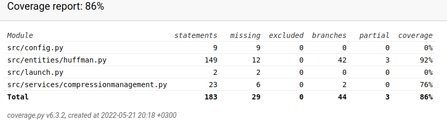

# Weekly Report #2

## Quick recap on progress
* Initial version of Huffman algorithm built. Header still needs to be compressed more efficiently. 
* Decoding has an issue that needs to be fixed. Last character is not decoded. One of the tests currently fails. 
* GUI now has basic functionalities
* First tests written
* Code cleaned and refactored based on pylint feedback
* Code formatted with autopep8
* Docstring written for code
* Content created for How-to-guide
* New features can be tested by following the instructions in the how-to-guide
* Application has been tested on University virtual computer environment. 

## What have I done this week?
I was unfortunate to catch a flu previous weekend and was on a sick leave from work for the whole week. I did my best to put energy into the project and am once again satisfied with what I have done under the circumstances. Looking forward next week, hopefully without a flu and with time and energy to fully commit to this project. The biggest thing for me this week has been the growing excitement while learning more on data compression. So far this has been the favorite course I have taken. It feels great to have such passionate feelings on a subject one is studying! 

On a more conrete level I read more on the Huffman coding and built a first version of the algorithm. I did struggle quite a bit with understanding the algorithm fully, but I think I have a good understanding of the basic functionalities now. I also created first functionalities in the GUI. I had to learn on how to use filedialog (file explorer) in Tkinter and it was a great new thing to learn! A user can now compress / uncompress files from the GUI. 

To make testing easier, files can also be compressed/uncompressed directly from huffman.py file. When using this option, please note that the default file directory is configurable in the .env file. 

## How has the application progressed?
* Initial version of Huffman coding algorithm is implemented
* txt-files with ASCII (256) coded content can be compressed and uncompressed
* compressed files have ".huf" as an extension
* An initial simple analysis file is created on compression results. Analysis data is also shown in the GUI
* The GUI has first working functionalities
* The application has semi-extensive docstring
* The application now uses dotenv for easier configuration
* First tests written. One test fails because of an issue in decoding method. More details below. 

## What did I learn during this week / today?
I learned a lot more on Huffman coding and know now how to proceed with that part of this project. I also learned a new useful skill for GUI - creation (how to open file explorer to read files). 

## What remained unclear or caused difficulties? 
While writing tests I learned that my code for decoding does not work. For a reason that is at the moment unknown to me the last character is not decoded. At the moment my code for decoding looks like this. 

```
    node = self.root_node
    i = 0
    while i < len(self.compressed):
        byte = self.compressed[i]
        if byte == "1" and node.right_child:
            node = node.right_child
            i += 1
        elif byte == "0" and node.left_child:
            node = node.left_child
            i += 1
        else:
            self.uncompressed += chr(node.character)
            node = self.root_node
```

As can be seen by using the terminal command `poetry run invoke test`, the failing method showcases the difference between the original and uncompressed content (the last character is missing):
```
--------------------------------------------------------------------- Captured stdout call ----------------------------------------------------------------------
original content:  AABBBCDDEEEEFFFGHIJKLMN , uncompressed content:  AABBBCDDEEEEFFFGHIJKLM
```


I will look into this issue next and I'm confident that I will be able to solve it. Unfortunately I ran out of time before the deadline. For the time being one of the tests fails, as it should because of this issue. 

On top of the before mentioned issue with decoding algorithm, I still need to improve the Huffman algorithm in multiple ways. Currently it only handles .txt-files with ASCII 256 content. I would like to look into how to make the algorithm a bit more universal. 

The other issue to solve is storing the huffman tree. I had trouble finding good material, most likely because I did not fully understand what search terms to use. I asked for sources on good tutorials on the subject at the Telegram channel and got a very good tip. The tutorial had a lot of good vocabulary so I am confident that finding more tutorials on the topic will be easier! 

## Pylint and Pytest - status update
In this weeks tasks unittests and cleaning code had a special focus. 

At the moment of writing this the Pylint score of the application is 9.62/10 and there are a few open issues to be dealt with. The branch coverage is 70-86 percent (86 when I enable the crude and imperfect fix for the decoding issue mentioned before, 70 percent without the test for decoding). The tests are not as of yet diverse and need to be worked on. I got some good ideas from the Telegram discussion on how to expand the tests in the upcoming week. 



As I wrote the tests I noticed an error with my decoding method. For some reason the final character of the compressed content was left out while decoding. That was a very clear demonstration of the benefits of extensive testing!  

## Next steps
* Fix issue with Huffman compression's decoding
* Build initial version of Lempel-Ziv 77 algorithm
* Improve Huffman coding
* Improve compression analysis

## Study hours for week #2

| Date (dd/mm/yyyy) |Task | Hours |
| ---- | ---- | ---- |
| 17.5.2022 | Reading up on Huffman coding  | 2 |
| 18.5.2022 | Start building first version of Huffman code  | 2 |
| 19.5.2022 | Finish first working version of Huffman code | 3 |
| 20.5.2022 | Create GUI functionalities, learn to use filedialog | 2 |
| 20.5.2022 | Create initial service class for compression, refactor entities class | 1 |
| 20.5.2022 | Write initial how-to-guide, test application on university virtual machine. | 0,5 |
| 20.5.2022 | Polish GUI, create LabelFrames for widget-layout | 1 |
| 21.5.2022 | Refactor code based on pylint feedback | 1 |
| 21.5.2022 | Create initial analysis data view for GUI | 1 |
| 21.5.2022 | Write initial tests | 2 |
| 21.5.2022 | Try to solve bug in decoding without success, update documentation | 1 |
| **total**| ---- | **16,5** |
