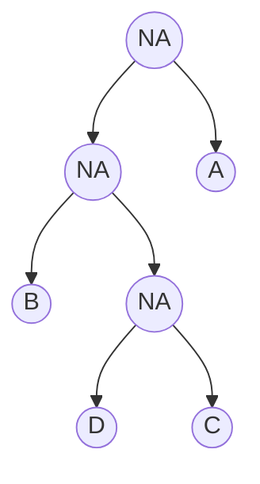

# Weekly Report #3

## Quick recap on progress
* Created first working version of LZ77 algorithm
* LZ77 compressed data is written as bytes into a file. 
* LZ77 algorithm and data storing need optimization.
* Found a way to store Huffman tree
* Huffman coding compressed data is all stored as ones and zeroes. There are still issues with the uncompression of the data. Will work on these in week 4. 
  * EDIT 29.5.2022: Issues seem to be fixed now. Compression and decompression seem to work! 
* Fixed issue with Huffman decoding left unsolved in week 2. It now has brand new issues. 
* Found an edge case while writing tests: Encountered a new issue with Huffman coding - can not compress files with just one character. 
  * These edge cases need to be thought about in the upcoming weeks. 


## What have I done this week?
The biggest concrete progression this week has been creating the first working version of Lempel-Ziv 1977 (LZ77) algorithm. Data can now be compressed and uncompressed with the algorithm. Another big time sink this week has been learning some basics on storing data in binary form. This is a topic that I was not familiar with before hand and it has taken a lot of time to get a grasp on how data can be stored. It is very likely that the solutions I use currently are not optimal and need to be worked on. I will discuss about this with the course teacher next week.  

One more big step for this week was that all compressed data created by Huffman coding is now stored as ones and zeroes. **Some issues needs to be fixed** as for some reason the data is **not uncompressed correctly**. Once the issues are fixed, writing the data as bytes should now be a simple step away. To achieve this I had to learn how to store a Huffman tree in a compact form. Especially re-creating the tree from the compact form required a lot of thinking. The tree is now stored in the following way

* EDIT 29.5.2022 Above mentioned issues with uncompression are fixed. Testing still required. 

```
1. First traverse left and store all the left nodes (as zeroes)
2. Once you can not go left anymore, go right in the first possible location. Store nodes on right as ones.  
3. Repeat one and two if possible
```

As an example assume we have the following tree



Following the instructions above it would be stored in the form `001011`


### Earlier issue with Huffman tree decoding
EDIT 29.5.2022: This issue has now been initially fixed. Further testing needed. 

At the moment I suspect that the issue with the Huffman coding is either with the creation of the compressed Huffman tree or in recreating the Huffman tree from that compressed form. The following algorithm creates the compressed Huffman tree. The idea is that the algorithm traverses the tree and while doing so creates a compressed form of the tree as mentioned above: 

```python
    def storable_huffman_tree(self,
                            node,
                            tree_string: str = "",
                            tree_characters: str = ""):

        if not node.left_child and not node.right_child:
            tree_characters += f"{bin(node.character)[2:].zfill(8)}"
        if node.left_child:
            tree_string += "0"
            tree_string, tree_characters = self.storable_huffman_tree(
                                node.left_child,
                                tree_string,
                                tree_characters)
        if node.right_child:
            tree_string += "1"
            tree_string, tree_characters = self.storable_huffman_tree(
                                node.right_child,
                                tree_string,
                                tree_characters)
        return tree_string, tree_characters
```

The following algorithm decompresses the tree. The idea is that the algorithm has the tree and the characters as ones and zeroes. The characters are stored with the following logic. As for an example character "A" has the ASCII value 65. From this a string representation is created with the following command:

```python
b = bin(65)[2:].zfill(8)
print(b)
'01000001'
```
This can then be restored to it's original form with

```python
print(int(b, 2))
65
```

As the tree is recreated every time a leaf node is reached, a character is placed there. The characters are placed in order. 

```python
    def decompress_huffman_tree(self, node, tree, tree_idx, characters, char_idx):
        if tree_idx + 1 == len(tree):
            character = int(characters[char_idx: char_idx + 8], 2)
            l_node = HuffmanNode(character, 0)
            node.right_child = l_node
            return 0, 0
        if tree[tree_idx] == "0":
            left_child = HuffmanNode(0, 0)
            node.left_child = left_child
            tree_idx, char_idx = self.decompress_huffman_tree(
                                left_child,
                                tree, tree_idx + 1,
                                characters,
                                char_idx)
            right_child = HuffmanNode(0, 0)
            node.right_child = right_child
            tree_idx, char_idx = self.decompress_huffman_tree(
                                right_child,
                                tree,
                                tree_idx + 1,
                                characters,
                                char_idx)
            return tree_idx, char_idx
        node.character = int(characters[char_idx: char_idx + 8], 2)
        return tree_idx, char_idx + 8
```

### Addition on 29.5.2022 - Cause of issue. 
The main cause turned out to be the algorithm responsible for decoding the stored Huffman tree. After a good nights sleep it dawned to me that there were issues with the code and it also could be simplified (no need to carry the index values for tree and characters in the new version). After some refactoring, the code now looks like this:

```python
    def decompress_huffman_tree(self, node, tree, characters):
        if len(tree) == 0:
            character = int(characters[:8], 2)
            node.character = character
            return "", ""
        if tree[0] == "0":
            left_child = HuffmanNode(0, 0)
            node.left_child = left_child
            tree, characters = self.decompress_huffman_tree(
                                left_child,
                                tree[1:],
                                characters)
            right_child = HuffmanNode(0, 0)
            node.right_child = right_child
            tree, characters = self.decompress_huffman_tree(
                                right_child,
                                tree[1:],
                                characters)
            return tree, characters
        if len(characters):
            node.character = int(characters[:8], 2)
            return tree, characters[8:]
```

## How has the application progressed?
* Data can be now compressed and uncompressed with two different compression algorithms. Huffman compression has open issues with decompression. Will be worked on in week 4. 
  * EDIT 29.5.2022: issues with Huffman compression initially fixed.
  * While debugging the issue I wrote a lot of tests to test out the Huffman compression / decompression. These were very useful in locating the issue and I think they'll be useful additions to the automated testing as well! 
  * Note: One test still fails. Will look into this on week 4. 
* Data compressed with LZ77 is written as bytes into a file. LZ77 compression is too slow. Will work on this in week 4. 
* The code was refactored in such amounts that the analysis data is not currently updated. Will be fixed on week 4. 

## What did I learn during this week / today?
I learned basics on LZ77 and scraped the surface on storing information as bytes. Both are absolutely fascinating subjects and diving deep would require a lot more time, and especially regarding the information storing also guidance/lessons. I do feel that with storing information in binary form I am a bit in deep waters, and I congratulate myself on getting something working together! 

## What remained unclear or caused difficulties? 
* Repairing issues with Huffman algorithm. Decompression needs more work.
  * EDIT: Fixed. Will still continue testing to make sure that it works as intended. 
* Storing data - is my current solution good. Would there be a better way?
* Optimizing the algorithms
  * Compression with LZ77 slows down as the window size expands. Significant slowdown can already be seen when the character size is a few thousand. Needs to be refactored. 
  * Storing optimal amount of information with LZ77
* Writing a comprehensive set of automated tests that with a decent reliability test that the algorithms work as they should

As I would like to talk about the data storing next week, I'll detail below how I currently store the data. 

### Storing data: Huffman coding
At the moment I decided to store the data with the following logic:
* Length of the tree building instructions (12 bits)
* Length of extra bits needed for the data to be full bytes (1-8 bits at the moment, could be 0-7 bits as well)
* number of characters (n < 256, so one byte)
* tree structure
* characters (8 * number of characters)
* compressed content
* extra bits (to have the data be full bytes)

### Storing data: LZ77
At the moment the data is stored as follows:
* Offset: 12 bits (window size is 4096)
* Length of match: 4 bits (lookahead buffer is 16)
* Next character: byte (ASCII characters)

One optimaztion I have in mind is that I only need the next character in situations where a match is not found. Each character left out saves one byte, so there will be significant saving.  


## Pylint and Pytest - status update
At the moment the Pylint score is `9.84` and there are some open issues to be dealt with. The code was rewritten this week and there is need for refactoring. Some commented code is also present at the moment. These will be removed during the next week.  
* EDIT 29.5.2022: Pylint score now `9.67`. Issues will be taken care of during the course. 

```
************* Module entities.huffman
src/entities/huffman.py:4:0: R0902: Too many instance attributes (10/8) (too-many-instance-attributes)
src/entities/huffman.py:36:8: C0200: Consider using enumerate instead of iterating with range and len (consider-using-enumerate)
src/entities/huffman.py:322:12: W0612: Unused variable 'key' (unused-variable)
src/entities/huffman.py:312:4: R0915: Too many statements (26/20) (too-many-statements)
src/entities/huffman.py:368:12: W0612: Unused variable 'key' (unused-variable)
************* Module entities.lempelziv77
src/entities/lempelziv77.py:6:0: R0902: Too many instance attributes (10/8) (too-many-instance-attributes)

------------------------------------------------------------------
Your code has been rated at 9.84/10 (previous run: 9.84/10, +0.00)
```

As there are open issues with the Huffman coding, the **failing tests have been deactivated** until issues are fixed. Deactivated tests have a comment above them. New tests have been written for LZ77 compression algorithm. 
EDIT: All tests activated. One test fails. Perhaps issue is in test, not in algorithm as all other similar tests succeed? 


## Next steps
* Optimization:
  * Time efficiency
    * Optimize compression time efficiency with LZ77
  * Space efficiency
    * Optimize space consumption on stored data on both algorithms
* Address Pylint issues

## Study hours for week #3

| Date (dd/mm/yyyy) |Task | Hours |
| ---- | ---- | ---- |
| 22.5.2022 | Fix issue with Huffman compression decoding | 0,5 |
| 22.5.2022 | Study automated tests and LZ77 | 1,5 |
| 22.5.2022 | Write test, discover a new issue with Huffman coding (one character files) | 1 |
| 23.5.2022 | Study LZ77, start drafting algorithm | 1 |
| 24.5.2022 | Study LZ77, work on algorithm | 2 |
| 25.5.2022 | Short online call with the teacher | 0,25 |
| 25.5.2022 | Finish first working versin of LZ77 | 1,5 |
| 25.5.2022 | Study writing binary files | 1 |
| 26.5.2022 | Study writing binary files | 1,5 |
| 26.5.2022 | Create first working version of Lempel-Ziv 77 compression/uncompression using files | 2 |
| 27.5.2022 | Create a working storable Huffman tree | 1 |
| 28.5.2022 | Change Huffman coding to 0's and 1's | 2 |
| 28.5.2022 | Work on tests | 1 |
| 28.5.2022 | Write documentation | 1 |
| 28.5.2022 | Study and try to fix open issues | 1 |
| **total**| ---- | **18,25** |

