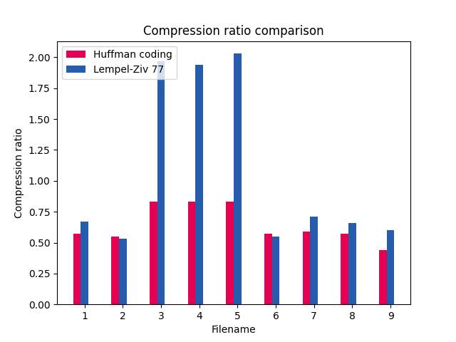
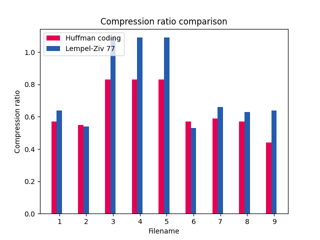
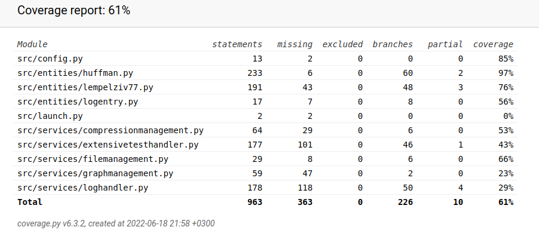

# Weekly Report #6

## Quick recap on progress
- Continued optimization. A 15MB file containing the Top 10 books from Project Gutenberg can be compressed and uncompressed in a reasonable time. 
- Tests are now divided into two different groups:
  - Fast tests: these are now ran every time the application starts
  - Extended tests: tests for large files (size over 1MB). 
- Changed UI-layout, simplified compression/uncompression functionalities.
- Created a new log-file for manually driven extended tests. Log-file is now an HTML-file and includes graphs and tables. 
- Documentation updated:
  - [Execution documentation](execution-documentation.md)
  - [Architecture documentation](architecture.md)
  - [Testing documentation](testing-documentation.md)

## What have I done this week?
This week I spent quite a lot of time on building a HTML-log-file. It was a learning experience, but I'm satisfied with the result. The most time went on learning how to construct graphs using Python and on deciding what measurements to include in the report. I am pleased with what I have done so far, but hope to get good tips on how to improve what I now have from the demo-session next week.  

The other bigger thing was refactoring Lempel-Ziv 77 bit-form data. Previously I stored `12 bits for offset, 4 bits for length and 8 bits for character` when no match was found and `12 bits for offset, 4 bits for length` when a match was found, because there was no need to keep the character if it could be retrieved from the already uncompressed content.  

I refactored this in a form that I now store `1 bit indicator, 8 bits for character` when no match is found and `1 bit indicator, 12 bits for offset and 4 bits for length` when a match is found. At the end of the file I have a break character `00000000` indicating that the content ends here.  

I was a bit surprised with the end result. I had deducted beforehand that the biggest benefits is seen on files that have very little matching characters in them. What surprised me was that for files with a good amount of matches found the compression ratio worsened. This makes sense as storing the matches now takes one bit more and if savings are rare, the compressed size increases. There was however a good improvement on the compression of files with random data, as can be seen in the graphs below.  

Files 3-5 contained random ASCII data with very little repetition. As can be seen in the image above, the compression ratio with the old Lempel-Ziv compression solution was close to 2.0, meaning that the compressed file took twice as much size. In the image below it can be seen that even if the compressed file still takes more space, there is a big improvement. On many of the other files there was a slight decrease on efficiency however.  

## How has the application progressed?
- Log-file has been improved. Data is now showcased as a table and log-report includes graphs on selected measures. 
- Lempel-Ziv 77 bit transformation reconstructed. Efficiency for random content gained, with the cost of slight decrease on repetitive content. 
- In extensive tests user can now set minimum character length for files to include in testing. 

## What did I learn during this week / today?
I had high hopes for the Lempel-Ziv 77 compression ratio improving with the changes I made to the bit-transformation process and I was somewhat disappointed with the results. I would like to to make my application more efficient, but I am stumped for now. 

## What remained unclear or caused difficulties? 
I have a few questions for this week as well:
- I would very much appreciate suggestions on how to improve the compression ratio. It'd be great to get the ratio closer to 40-50 percent on Lempel-Ziv 77, but I am short on ideas. 
- My current measures for compression efficiency are as listed below. Are these good measures considering the purpose of this course? Is something essential missing?
  - Compression ratio
  - Compression time (+ data management time)
  - Huffman coding frequency variance: this indicates how much variance there is in the Huffman frequencies. As a crude rule the more variance there is, the more efficient the compression is, as the more frequent characters have shorter branches in the tree
  - Lempel-Ziv 77 average match length: As a crude rule the higher the match length, the better the compression rate. 
- A lot of the new service classes include writing or reading from a file. Should these classes be also tested? What would be a good approach to this? Perhaps I could configure a different folder for testing read and write operations so that none of the existing files are altered or deleted? 

## Pylint and Pytest - status update
This week I have written a lot of new functionalities in the service classes and these are still missing tests. Because of this, the branch coverage has now decreased to 61 percent. 

## Next steps
- I caused a bug in the app this week. The app doesn't close properly if the used does not use the menu to exit. I need to fix this bug before the deadline
- Improve code quality
- Expand tests
- Add more material for testing
- Add missing docstring
- Try to improve compression ratio

## Study hours for week #6

| Date (dd/mm/yyyy) |Task | Hours |
| ---- | ---- | ---- |
| 12.6.2022 | Optimize algorithms | 1 |
| 12.6.2022 | Fetch more test material | 0,5 |
| 12.6.2022 | Experiment compression with 15 MB file | 1 |
| 12.6.2022 | Add tests, add quick tests to launching of the app | 0,5 |
| 12.6.2022 | Add content validation to extensive testing | 0,5 |
| 13.6.2022 | Refactor logging, study creating graphs with Python | 2 |
| 14.6.2022 | Create initial version of HTML-log documentation | 2 |
| 15.6.2022 | Finalize first version of HTML-formatted log | 2 |
| 16.6.2022 | Peer-review | 2 |
| 16.6.2022 | Add graphs to HTML-formatted log | 3 |
| 17.6.2022 | Re-build LZ77 bit-transformation | 2 |
| 18.6.2022 | Add LZ77 mean offset to HTML-log | 1 |
| 18.6.2022 | Change LZ77 str.find to str.rfind and study effects | 0.5 |
| 18.6.2022 | Write documentation | 1 |
| **total**| ---- | **19** |
